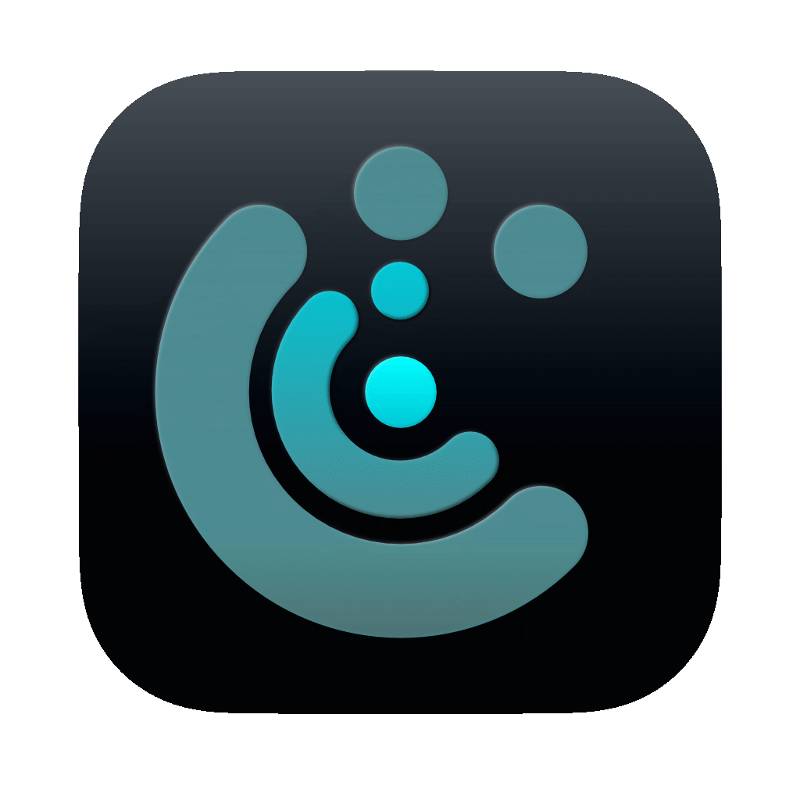

<div align="center">
  
</div>

# END

**Ephemeral Nexus Display**

The long and winding road finding the truly best opinionated cross-platform, dual-backend renderer, rich-featured, modern terminal emulator with non-web stack true Markdown and Mermaid renderer that can run on your grandma's PC finally comes to END.

---

## Why END?

Modern terminal emulators are GPU-only. No GPU, no terminal. They require recent OS versions. They ship with web stacks, Electron shells, or language runtimes that bloat memory and startup. They outsource multiplexing to tmux — a separate server process with its own keybinding language and rendering limitations. None of them can render a Markdown file without shelling out to a browser.

END solves all of these.

**C++17 and JUCE.** The same stack that powers professional real-time audio — sub-millisecond latency, zero-allocation hot paths, cross-platform abstraction that actually works. JUCE provides native windowing, OpenGL context management, threading primitives, and a component model battle-tested across thousands of commercial products. No web engine. No garbage collector. No runtime. The binary is the application.

**Dual renderer.** OpenGL instanced rendering when a GPU is available. SIMD-optimised software renderer (SSE2/NEON) when it is not. Switch between them at runtime with a config reload — no restart. END runs on a 2015 iMac, a headless Linux box, or a Windows 10 machine with integrated graphics. If it has a screen, END runs on it.

**Built-in multiplexing.** Tabs, binary tree split panes, popup terminals — no tmux, no server process, no socket management. Application state is a ValueTree (XML). The final milestone is full session serialization that restores every tab, pane, and working directory on relaunch.

**Native Markdown and Mermaid.** Open a `.md` file from the terminal and it renders natively in a split pane — headings, tables, code blocks, Mermaid diagrams — same rendering stack, same window, same font system. No browser, no Electron, no external process. That is WHELMED.

**Native glass blur.** Real compositor-level blur on macOS (10.14+) and Windows (10+). Not a transparency hack — the desktop bleeds through.

**Lua-configurable everything.** Two config files, hot-reloadable. Every colour, every keybinding, every font, every UI element. The config files are the documentation.


## Features

**Dual Renderer**
- GPU: OpenGL instanced text rendering — glyph atlas, instanced quads, 3 draw calls per frame at 120fps
- CPU: SIMD-optimised software renderer (SSE2/NEON) — same quality, no GPU required
- Runtime GPU/CPU switching via config hot-reload (Cmd+R)
- Dual texture atlas: mono glyphs (R8) + colour emoji (RGBA8)
- Shelf-packed atlas with LRU eviction

**Text**
- CoreText on macOS, FreeType on Linux/Windows — native quality on each platform
- HarfBuzz text shaping with ligature support
- Nerd Font icons with per-glyph constraint scaling (ported from NF patcher v3.4.0)
- Procedural box drawing, block elements, and braille — pixel-perfect at any cell size, no font dependency
- System font fallback via CoreText cascade for missing glyphs
- Colour emoji (Apple Color Emoji, Noto, system fonts)
- Configurable cell width, line height, and emboldening

**Terminal**
- Full xterm-256color + 24-bit true colour
- Unicode grapheme segmentation (UAX #29 state machine, Unicode 17.0)
- Wide character support (CJK, East Asian Width)
- Kitty keyboard protocol (progressive enhancement, per-screen flag stacks)
- SGR mouse tracking (modes 1000/1002/1003/1006 — tmux and vim just work)
- Bracketed paste, focus events, bell
- Alternate screen buffer (vim, htop, less, TUI apps)
- DECTCEM cursor visibility
- Scrollback with configurable history
- Ring buffer grid with reflow-on-resize

**OSC and Shell Integration**
- OSC 7: working directory tracking
- OSC 8: hyperlinks (parsed and merged with heuristic link detection)
- OSC 9/777: native desktop notifications (macOS UNUserNotificationCenter, Windows/Linux fallback)
- OSC 52: clipboard access (base64)
- OSC 133: shell integration markers (A/B/C/D output block tracking)
- Automatic shell integration injection (zsh, bash, fish)
- Clickable hyperlinks on command output rows

**UI**
- Tabbed interface with configurable position (top, bottom, left, right)
- Split panes with binary tree layout — horizontal and vertical, draggable dividers
- Prefix-key pane navigation (tmux-style) — fully configurable keys and timeout
- Command palette: fuzzy-searchable action list with glass blur overlay
- Popup terminals: user-defined modal floating terminals for TUI apps (lazygit, htop, tit, etc.)
- File opener with flash-jump hint labels — keyboard-jumpable file paths from command output
- Vim-like selection mode: visual, visual-line, visual-block with keyboard cursor navigation in scrollback
- Word selection (double-click), line selection (triple-click)
- Status bar with modal state display
- Configurable cursor: any character, Nerd Font icon, or colour emoji — with optional blink
- Text selection with transparent overlay
- Drag-and-drop file paths with configurable quoting

**Platform**
- macOS: CoreText rendering, native glass blur, UNUserNotificationCenter
- Linux: FreeType rendering, notify-send notifications
- Windows: ConPTY backend (NT API duplex pipe, overlapped I/O), glass blur (Win10 DWM / Win11 system effect)
- Borderless window with configurable title bar buttons
- Multi-window support (Cmd+N)
- Window state persistence (size, zoom saved across sessions)
- Configurable zoom (Cmd+/-/0) with full font resize

**Configuration**
- Lua hot-reload (Cmd+R, no restart)
- Lock-free render pipeline — reader thread writes atomics, VBlank polls dirty flags, GL thread acquires snapshot via atomic pointer exchange
- Zero allocations on the render path
- Unified action registry: every keybinding is configurable, global or modal, or both


## Popup Terminals

Most terminals let you split panes. END lets you define named popup terminals — modal floating windows that spawn a full PTY running any command, overlaid on top of your terminal. Think tmux popup, but native and configured in Lua.

Each popup is a complete terminal instance with its own PTY, session, grid, and state. It shares END's font system and renderer — GPU or CPU, same quality. The popup blocks the main terminal until the process exits. Quit the TUI, the popup disappears.

```lua
popups = {
    tit = {
        command = "tit",
        cwd = "",              -- inherit active terminal's working directory
        cols = 70,
        rows = 30,
        modal = "t",           -- prefix key then t
    },
    lazygit = {
        command = "lazygit",
        cwd = "",
        cols = 120,
        rows = 40,
        modal = "g",
        global = "cmd+shift+g",  -- or skip the prefix entirely
    },
}
```

Every popup entry gets a modal key (prefix + key), a global shortcut, or both. They also appear in the command palette as searchable actions. You define your TUI toolkit once in `end.lua` — git client, process monitor, file manager, whatever — and launch any of them with a keystroke from any terminal pane.


## WHELMED

**WYSIWYG Hybrid Encoder Lightweight Markdown/Mermaid**

WHELMED is END's built-in Markdown and Mermaid renderer. Click a `.md` hyperlink in the terminal and it opens as a native split pane — no browser, no electron, no external process. Same window, same rendering stack.

**Rendering:**
- Headings (h1-h6), paragraphs, lists with full styled text
- Inline code and fenced code blocks with syntax colouring
- Tables with header rows, column alignment, alternating row colours
- Mermaid diagrams rendered from SVG parse — viewbox-driven scaling
- Vim-style keyboard navigation and text selection

WHELMED shares END's font system, glyph atlas, and GL/CPU renderer. It runs as a `PaneComponent` — the same interface as a terminal pane.

**Status:** Headings, paragraphs, lists, code blocks, tables, and basic Mermaid rendering are working. Mermaid support is being expanded.


## Get Started

```bash
cmake -S . -B Builds/Xcode -G Xcode
cmake --build Builds/Xcode --config Release
```

Requirements: C++17 compiler, CMake, JUCE 8


## Configuration

Everything lives in `~/.config/end/`. Both config files are auto-generated with documented defaults on first launch. Every value has inline comments. Edit, press Cmd+R to reload. Invalid or missing values fall back to defaults silently.

### `end.lua` — Terminal

| Section | What you can configure |
|---------|----------------------|
| `gpu` | Rendering backend: auto, force GPU, force CPU |
| `font` | Family, size, ligatures, emboldening, line height, cell width |
| `cursor` | Character (any glyph, NF icon, emoji), blink, blink interval, force shape lock |
| `colours` | Foreground, background (with alpha for transparency), cursor, selection, full 16-colour ANSI palette, status bar colours, hint label colours |
| `window` | Title, dimensions, tint colour, opacity, blur radius, always-on-top, title bar buttons, zoom |
| `tab` | Font family/size, position (top/bottom/left/right), active/inactive/indicator colours |
| `menu` | Popup menu background opacity |
| `overlay` | Status message font family/size/colour |
| `shell` | Program, args, automatic shell integration toggle |
| `terminal` | Scrollback lines, scroll step, padding (top/right/bottom/left), drag-and-drop file separator and quoting |
| `pane` | Divider bar colour and highlight colour |
| `keys` | Every keybinding: copy, paste, quit, close, reload, zoom, tabs, splits, pane navigation, selection mode (visual/visual-line/visual-block with vim keys), open-file mode, command palette, prefix key and timeout, status bar position |
| `popup` | Default popup dimensions, position, border colour and width |
| `hyperlinks` | Editor command, per-extension handler overrides, extra clickable extensions |
| `popups` | Named modal popup terminals: command, args, cwd, dimensions, modal key, global shortcut |

### `whelmed.lua` — Markdown Viewer

| Section | What you can configure |
|---------|----------------------|
| Typography | Body font family/style/size, code font family/style/size, line height |
| Headings | Individual font size for each heading level (h1-h6) |
| Layout | Content padding (top/right/bottom/left) |
| Colours | Document background, body text, link, per-heading-level colours |
| Code blocks | Fence background, inline code colour, 11 syntax token colours (keywords, strings, comments, operators, identifiers, integers, floats, brackets, punctuation, preprocessor, errors) |
| Tables | Background, header background, alternating row colour, border colour, header/cell text colours |
| Progress bar | Background, fill, text, spinner colours |
| Scrollbar | Thumb, track, background colours |
| Selection | Highlight colour |
| Navigation | Vim-style scroll keys (j/k/gg/G), scroll step in pixels |

### `state.lua`

Auto-saved window state (size, zoom). Not user-edited.


## Roadmap

| Feature | Status |
|---------|--------|
| WHELMED Mermaid | In progress — basic rendering works, expanding coverage |
| Sixel inline images | Planned |
| iTerm2 inline images (OSC 1337) | Planned |
| Terminal state serialization | Spec written |


## Documentation

| Doc | Contents |
|-----|----------|
| [SPEC.md](SPEC.md) | Roadmap and feature specifications |
| [ARCHITECTURE.md](ARCHITECTURE.md) | System design, threading model, data flow, module map |
| Source code | Doxygen annotations across all source files |


## Platform Support

| Platform | Status |
|----------|--------|
| macOS | Primary — CoreText, native glass blur, desktop notifications |
| Linux | Supported — FreeType rendering |
| Windows | Supported — ConPTY backend, glass blur |


## License

MIT

---

Rock 'n Roll!

**JRENG!**

---
conceived with [CAROL](https://github.com/jrengmusic/carol)
