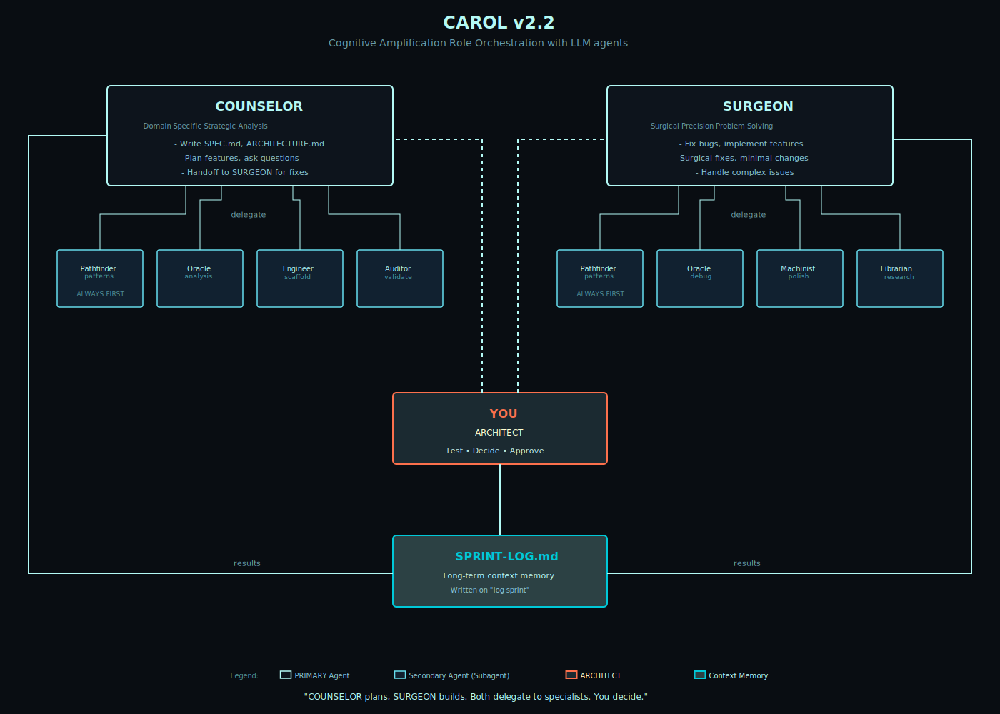

# CAROL

```
    ████████     ████     ██████████     ████████   ████
  ████░░░░░░   ████████   ████░░░░████ ████░░░░████ ████
████░░       ████░░░░████ ████    ████ ████    ████ ████
████         ████    ████ ██████████░░ ████    ████ ████
████         ████████████ ████░░████   ████    ████ ████
░░████       ████░░░░████ ████  ░░████ ████    ████ ████
  ░░████████ ████    ████ ████    ████ ░░████████░░ ████████████
    ░░░░░░░░ ░░░░    ░░░░ ░░░░    ░░░░   ░░░░░░░░   ░░░░░░░░░░░░
```

**C**ognitive **A**mplifier **R**ole **O**rchestration for LLM agents

Version: 0.0.6

An opinionated ritualistic framework that enforces discipline to work with multiple agents simultaneously.

CAROL was never meant to be used for 100% vibing, you could if you want. But it helps agents from drifting from the course of development while maintaining human still responsible for every line of code.

CAROL also works effectively as a rapid prototyping methodology for experienced architects exploring unfamiliar stacks.

**CAROL is your preamp.**

A high-end preamp never eliminates noise — and distortion sometimes becomes its signature color. But the signal-to-noise ratio is always at the highest. CAROL does the same for LLM sessions. It doesn't produce sterile, generic output. It has your character baked in — your coding contract, your naming conventions, your architectural philosophy. The distortion is intentional and consistent.

The model is the signal source. CAROL is the signal chain. The output has your signature.

Context is headroom. Keep transients below it, but enough signal to record. Sessions are takes — you don't stop because time ran out, you stop because you got what you needed. Anything after that is noise on tape. SPRINT-LOG is the pool — distilled signal from every take, ready for the next session to reference without replaying the entire reel.

---

---

## Why

At its infancy, LLM agents are unreliable assistance for development. Commercial agentic models produce deterministic binary results—either they populate super fast thousands of lines of code that might work, or they give you piles of garbage that will exhaust your tokens, credits, time, patience, and eventually your sanity to debug.

LLMs suffer from:
- **Scope creep:** Adding features not requested
- **Cognitive overload:** Reading entire codebase, hitting sprint limits
- **Autonomous mistakes:** Making changes without asking
- **Inconsistent patterns:** Each agent invents new approaches

### Solution

**1. You maintain architectural coherence:** No agent can fuck up the big picture because you're the one holding it. You're validating intent at each handoff.

**2. Domain transfer without syntax debt:** Fuck MCP. You are the living embodiment of Human Context Protocol. You control the flow. You are the architect. The agents translate your architectural intent into the programming language syntax.

**3. Role-based constraints:** Each role has explicit behavioral rules and reads only what they need.

**Result:** Reduced failures, lower costs, faster development.

---

## What

CAROL is a role-based agent orchestration framework for collaborative software development. It's a cognitive load distribution system that prevents agent drift by enforcing specialized roles with explicit constraints and clear handoffs.

### Upstream Agent (1)

**BRAINSTORMER** - Pre-flight Shadow Agent
   Operates upstream of COUNSELOR. Researches, ideates, prototype-sketches, and produces RFC.md for COUNSELOR handoff. Reads codebase but never executes. The last checkpoint before COUNSELOR picks up a task.

### Primary Agents (2)

**COUNSELOR** - Requirements Counselor & Planning Specialist
   Transforms conceptual intent into formal specifications. Asks clarifying questions, explores edge cases and constraints, writes comprehensive SPEC.md and ARCHITECTURE.md. Handles all documentation including SPRINT-LOG.md updates on "log sprint" command. Never writes code directly. Uses SPEC-WRITER.md and ARCHITECTURE-WRITER.md as guides to clarify ARCHITECT's architectural vision into formalized development documents.

**SURGEON** - Complex Fix Specialist
   Handles bugs, performance issues, edge cases, and architectural corrections that other agents cannot solve. Identifies root cause, implements minimal surgical fixes. Does not refactor entire modules or touch unrelated code.

### Secondary Agents (7)

**ENGINEER** - Literal Code Generator
   Implements features exactly as specified in kickoff documents. Generates boilerplate, structures, and straightforward implementations. Follows specifications literally without adding features, optimizations, or making architectural decisions. Uses exact names, types, and signatures from SPEC.md as referenced in kickoff plans.

**ORACLE** - Deep Reasoning Specialist
   Provides deep analysis and second opinions when invoked by COUNSELOR or SURGEON. Can read codebase (grep, cat, find) and research web for patterns. Returns structured analysis with trade-offs and recommendations. Never makes code changes—advisory only.

**LIBRARIAN** - Library/Framework Research
   Researches library internals, API docs, usage patterns, version-specific behavior, and best practices for specific dependencies. Called when agents need external library knowledge.

**AUDITOR** - Pre-Commit Auditor
   Performs systematic code review before commits. Validates against SPEC.md, checks architectural constraints (BLESSED principles), verifies style compliance, and identifies refactoring opportunities to mitigate technical debt. Writes comprehensive audit reports with severity classifications and recommendations.

**MACHINIST** - Code Polisher & Finisher
   Elevates scaffolds to production quality by fixing anti-patterns, ensuring fail-fast behavior, and integrating components. Makes all moving parts work together as a complete machine. Called when ENGINEER's scaffold needs finishing or after AUDITOR finds issues that need simple fixes. Can also triage AUDITOR findings (filter false alarms).

**PATHFINDER** - Exploration Specialist
   Investigates unfamiliar codebases, APIs, or technologies. Maps unknown territory, identifies integration points, and reports findings without making changes. Used when entering new domains or evaluating third-party libraries.

**RESEARCHER** - Information Gatherer
   Collects and synthesizes information from documentation, codebases, and external sources. Compiles reference materials and creates summaries for other agents to consume. Never modifies code.

### The cognitive load distribution:

**Old model (single agent handles everything):**

```
Single agent's context:
├─ Your project architecture (10k tokens)
├─ All previous decisions (20k tokens)
├─ Current feature requirements (5k tokens)
├─ Implementation details (15k tokens)
├─ All the code it wrote (30k tokens)
├─ Your feedback on what's wrong (10k tokens)
└─ Trying to fix while remembering all above (failing)

Total cognitive load: 90k+ tokens
Result: Single agent makes mistakes, over-engineers, loses track
```

**CAROL (distributed roles):**

```
BRAINSTORMER's context:
└─ Research + RFC production
   (10k tokens, pre-flight exploration)

COUNSELOR's context:
└─ RFC.md + feature requirements + planning
   (5k tokens, laser-focused on PLAN.md)

ENGINEER's context:
 └─ SPEC.md + scaffold these files
    (3k tokens, literal execution)

MACHINIST's context:
 └─ Scaffold to production quality
    (8k tokens, focused on polish and finishing)

SURGEON's context (when escalated):
└─ Specific complex problem + what failed + fix this one thing
   (8k tokens, surgical fix)
   
AUDITOR's context:
└─ review, refactoring opportunity, audit SPEC.md and ARCHITECTURE.md compliance
   (5k tokens)

Your context:
└─ SPEC.md + test each flow
   (Human brain, validating intent)

Total distributed: ~29k tokens across specialized roles
Result: Each agent performs optimally within their specialization
```

---

---

## How

Document-driven development pipeline with specialized artifacts:

### CAROL Workflow


---

## Key Features

- **Role-Based Constraints:** 9 specialized roles with explicit behavioral rules (2 Primary + 7 Secondary)
- **Agent-Agnostic:** Works with any LLM CLI tool (Claude Code, Opencode, Amp, Copilot, Gemini, whatever.)
- **Language-Agnostic:** Supports any programming language/framework
- **TDD-Friendly:** Built-in testing patterns and scripts
- **Git-Tracked:** Framework evolution tracked, projects reference SSOT
- **Flexible Distribution:**
   + **Symlink mode (default):** Update SSOT once → all projects update
   + **Portable mode:** Full copy, works offline, project self-contained

---

## Quick Start

### Installation

**One-Line Install (Recommended):**

```bash
curl -fsSL https://raw.githubusercontent.com/jrengmusic/carol/main/install.sh | bash
```

This will:

- Clone CAROL to `~/.carol`
- Download `carolcode` binary from GitHub Releases
- Symlink `carol` to `~/.local/bin/carol`
- Work on macOS and Linux (x64 and arm64)

**Manual Install:**

```bash
git clone https://github.com/jrengmusic/carol.git ~/.carol
~/.carol/install.sh
```

**Custom Install Location:**

```bash
CAROL_INSTALL_DIR=~/my/custom/path bash <(curl -fsSL https://raw.githubusercontent.com/jrengmusic/carol/main/install.sh)
```

### Initialize in Project

```bash
# In your project directory
cd /path/to/your/project

# Initialize CAROL (symlink mode - recommended)
carol init

# OR: Initialize in portable mode
carol init --portable
```

### Usage

```bash
# Check version
carol version

# Show help
carol help

# Update framework (symlink mode)
carol update
```

### Activate an Agent

After `carol init`, activate an agent by reading role definitions:

```
Read carol/CAROL.md. You are assigned as COUNSELOR.
```

No registration ceremony needed—calling is assignment.

### Uninstall

```bash
# Download and run uninstall script
curl -fsSL https://raw.githubusercontent.com/jrengmusic/carol/main/uninstall.sh -o /tmp/uninstall.sh
bash /tmp/uninstall.sh

# OR if CAROL is still installed
~/.carol/uninstall.sh
```

This will:

- Remove `~/.carol` directory (with confirmation)
- Clean up PATH from shell configuration files
- Create backups of modified files
- Warn about projects still using CAROL

Then reload your shell:

```bash
source ~/.zshrc   # zsh
# OR
source ~/.bashrc  # bash
```

---

## Architecture

**CAROL (This Repository):**

```
~/.carol
├── CAROL.md                  # Protocol, role definitions (SSOT)
├── CLAUDE.md → CAROL.md      # Symlink — auto-loaded by Claude Code
├── MANIFESTO.md              # BLESSED principles
├── NAMES.md                  # Naming conventions
├── SPEC-WRITER.md            # Counselor conversation guide
├── ARCHITECTURE-WRITER.md    # Architecture documentation guide
├── .claude/
│   ├── agents/               # Agent definitions
│   │   ├── brainstormer.md   # Pre-flight shadow agent (UPSTREAM)
│   │   ├── counselor.md      # Requirements counselor (PRIMARY)
│   │   ├── surgeon.md        # Complex fix specialist (PRIMARY)
│   │   ├── engineer.md       # Literal code generator
│   │   ├── oracle.md         # Deep reasoning specialist
│   │   ├── librarian.md      # Library/framework research
│   │   ├── auditor.md        # Pre-commit auditor
│   │   ├── machinist.md      # Code polisher
│   │   ├── pathfinder.md     # Exploration specialist
│   │   └── researcher.md     # Information gatherer
│   └── commands/             # Slash commands
├── templates/                # Project templates
│   ├── SPRINT-LOG.md
│   ├── ARCHITECTURE.md
│   └── config.yml
├── bin/carol                 # CLI tool
└── install.sh                # Installation script
```

**Project After `carol init`:**

```
your-project/
├── CLAUDE.md → ~/.carol/CAROL.md  # Symlink (or copy in portable mode)
├── RFC.md                         # BRAINSTORMER produces, COUNSELOR consumes
├── SPEC.md                        # COUNSELOR creates via SPEC-WRITER.md
├── PLAN.md                        # COUNSELOR writes per sprint
├── ARCHITECTURE.md                # Agents create via ARCHITECTURE-WRITER.md
├── carol/                         # Hidden via chflags (macOS) / attrib +h (Windows)
│   ├── SPEC-WRITER.md
│   ├── ARCHITECTURE-WRITER.md
│   ├── MANIFESTO.md
│   ├── NAMES.md
│   ├── SPRINT-LOG.md              # Updated by primaries on "log sprint"
│   └── config.yml
├── .claude/
│   ├── agents/                    # Agent definitions
│   └── commands/                  # Slash commands
├── src/                           # Your code
└── .gitignore
```

---

## Principles

CAROL aligns with **BLESSED** principles:

- **B**ound - Clear ownership, deterministic lifecycle, RAII enforced
- **L**ean - 300/30/3, god objects forbidden
- **E**xplicit - No magic, semantic names, fail fast
- **S**SOT - Declare once, reference everywhere
- **S**tateless - Objects are dumb workers, transient state only
- **E**ncapsulation - One responsibility, tell don't ask, unidirectional layers
- **D**eterministic - The verdict: what you get when BLESSE is followed

---

## Conceived by CAROL

- [TIT](https://github.com/jrengmusic/tit) - Terminal Interface for giT 
- [cake](https://github.com/jrengmusic/cake) - piece of cmake

---

## Contributing

Contributions welcome! This framework is:

- **Agent-agnostic** - Works with any LLM CLI
- **Language-agnostic** - Supports any tech stack
- **Battle-tested** - Born from real production failures

---

## License

MIT License - See LICENSE file

---

## Author

Rock 'n Roll!

**JRENG!** 🎸

---

## Documentation

- [CAROL.md](CAROL.md) - Protocol, role definitions (SSOT)
- [MANIFESTO.md](MANIFESTO.md) - BLESSED principles
- [NAMES.md](NAMES.md) - Naming conventions
- [SPEC-WRITER.md](SPEC-WRITER.md) - How COUNSELOR writes specs
- [ARCHITECTURE-WRITER.md](ARCHITECTURE-WRITER.md) - How agents document architecture
- [SPRINT-LOG.md](templates/SPRINT-LOG.md) - Sprint tracking template

---

## Support

- Issues: https://github.com/jrengmusic/carol/issues
- Discussions: https://github.com/jrengmusic/carol/discussions
