# Whelmed Markdown Viewer — Comprehensive Test Document

This document exercises every markdown feature and edge case for the Whelmed viewer. Scroll through to validate rendering across all block types, inline styles, code fence languages, mermaid diagrams, and performance stress sections.

---

# 1. Headings

# Heading Level 1 — Document Title

This is body text under an H1 heading. H1 headings represent top-level document sections, typically used once per document or for major chapter breaks. The renderer must apply the correct font size, weight, and spacing relative to the body text.

## Heading Level 2 — Chapter

H2 headings are the primary structural dividers in a well-organized document. They appear frequently and must render with clear visual hierarchy below H1. Line spacing above and below should provide enough breathing room that readers can scan sections without confusion.

### Heading Level 3 — Section

H3 headings break chapters into named sections. In technical documentation, these often correspond to specific features, APIs, or subsystems. The visual weight should be clearly less than H2 but still distinct from body text.

#### Heading Level 4 — Subsection

H4 headings are used for fine-grained structure within sections. In code documentation they might label individual functions, configuration keys, or parameter groups. The font size here may approach body text size, relying more on weight or color to distinguish itself.

##### Heading Level 5 — Detail

H5 headings are rare in most documents but must render correctly. They appear in deeply nested documentation, legal and specification documents, and in generated API references. The visual distinction between H4 and H5 should be perceptible but subtle.

###### Heading Level 6 — Minor Note

H6 is the deepest heading level in the CommonMark specification. It is almost never used in practice but must be supported by any compliant renderer. The rendering must be distinguishable from body paragraph text while remaining clearly subordinate to all other heading levels.

---

# 2. Text Styles

## Plain Paragraphs

The terminal emulator is the most demanding component of any developer-facing application. It must process a continuous stream of bytes arriving at unpredictable rates, interpret ANSI escape sequences that were designed in the early 1970s and have accreted decades of extensions, maintain an accurate model of the virtual screen buffer, and push rendered frames to the display system at a rate that feels instantaneous to the user. Latency above twelve milliseconds between keystroke and visible output is perceptible to experienced terminal users. Latency above fifty milliseconds actively impairs productivity in interactive workflows like shell completion, text editing, and debugger navigation.

The scroll buffer is a separate concern from the active screen. When the user scrolls upward into history, the renderer must composite the historical lines from the scroll buffer with any active selection overlays, search match highlights, and the cursor state. The scroll position itself is a floating-point offset measured in lines, allowing smooth pixel-level scrolling when the host window manager supports it. This means the renderer must handle partial-line rendering at the top and bottom of the visible area, which complicates glyph atlas lookups and vertex buffer construction.

OpenGL rendering of terminal content requires a two-phase approach. In the first phase, all unique glyphs visible in the current frame are identified and any glyphs not present in the atlas are rasterized and uploaded to the GPU texture. In the second phase, a vertex buffer is constructed where each glyph cell is represented as a textured quad with per-vertex color attributes encoding foreground and background colors. The entire visible frame can then be drawn in a single draw call on most frames, with additional draw calls only for the cursor, selection overlay, and any special rendering effects like the vignette.

Font metrics must be computed precisely for monospace rendering. The cell width is derived from the advance width of the space character at the configured point size, scaled by the device pixel ratio. The cell height is derived from the sum of ascent, descent, and leading values from the font metrics. Any rounding during these calculations propagates as misalignment across the grid, producing visible artifacts when horizontal or vertical lines of box-drawing characters fail to connect cleanly. The solution is to compute cell dimensions in floating-point and round only at the final vertex coordinate stage.

Color management in a terminal emulator spans multiple color spaces and encoding schemes. The classic sixteen ANSI colors are defined as named palette entries whose exact RGB values vary between terminal emulators and user themes. The 256-color palette extends this with a 6x6x6 RGB cube and a 24-step grayscale ramp. True color sequences embed 24-bit RGB values directly in the escape sequence. The renderer must map all three representations into the same linear color space before compositing, which requires either a lookup table or inline conversion logic in the shader.

## Bold Text

**This entire sentence is bold and should render with increased weight or a heavier typeface variant.**

Text can transition from normal to **bold mid-sentence** and back to normal without any interruption to the reading flow.

**Multiple consecutive bold phrases** separated by **normal-weight conjunctions** must each render independently.

## Italic Text

*This entire sentence is italic and should render with a slanted or oblique typeface variant.*

Normal text transitioning to *italic mid-sentence* and back to normal must render without spacing artifacts.

*Italic text can span several words* and the transition back to upright text must be clean and pixel-accurate.

## Bold Italic Text

***This entire sentence is bold italic, combining both weight and slant.***

The combination of ***bold and italic*** styling must apply both transforms simultaneously without degrading legibility.

***Extended bold italic passages*** appear in warning callouts, critical notes, and stylistic emphasis in technical writing.

## Inline Code

The function `renderGlyph` accepts a `GlyphKey` struct and returns a `GlyphMetrics` value by copy.

Inline code spans like `juce::String`, `std::vector<float>`, and `nullptr` must render in a monospace typeface distinct from body text, typically with a subtle background highlight.

Template syntax such as `template<typename T, size_t N>` and operator overloads like `operator[]` must render without any special interpretation of the angle brackets or square brackets.

## Links

Visit the [JUCE framework documentation](https://juce.com/learn/documentation) for API reference.

The [CommonMark specification](https://spec.commonmark.org) defines the parsing rules this renderer must implement.

Links can appear [mid-sentence](https://example.com) without disrupting the flow of the surrounding text.

## Mixed Inline Styles

This paragraph combines **bold text**, *italic text*, ***bold italic***, `inline code`, and [a link](https://example.com) in a single run of prose to verify that the inline style parser handles transitions correctly and that no style bleeds into adjacent spans.

A **bold span containing `inline code` inside it** must render the code in monospace while maintaining the bold context for the surrounding text.

An *italic span containing a [link](https://example.com) inside it* must render the link with its visual affordance while the surrounding text remains italic.

The sequence **bold** then *italic* then ***bold italic*** then `code` then [link](https://example.com) then back to normal must each transition cleanly.

Nested styles that are technically invalid in strict parsers — like *italic with **bold inside** it* — must be handled gracefully, either by rendering the best interpretation or by falling back to plain text without crashing.

---

# 3. Code Fences — Supported Languages

## C++ — Audio Plugin Architecture

```cpp
#pragma once

#include <juce_audio_processors/juce_audio_processors.h>
#include <juce_dsp/juce_dsp.h>
#include <array>
#include <atomic>
#include <memory>

namespace Whelmed {

//==============================================================================
// GainProcessor — a simple gain stage with smooth parameter changes
//==============================================================================

class GainProcessor final : public juce::AudioProcessor
{
public:
    GainProcessor()
        : AudioProcessor (BusesProperties()
                          .withInput  ("Input",  juce::AudioChannelSet::stereo(), true)
                          .withOutput ("Output", juce::AudioChannelSet::stereo(), true))
    {
        addParameter (gainParam = new juce::AudioParameterFloat (
            "gain", "Gain", juce::NormalisableRange<float> (-60.0f, 12.0f, 0.01f), 0.0f));

        addParameter (muteParam = new juce::AudioParameterBool (
            "mute", "Mute", false));
    }

    ~GainProcessor() override = default;

    //==========================================================================
    void prepareToPlay (double sampleRate, int samplesPerBlock) override
    {
        juce::dsp::ProcessSpec spec;
        spec.sampleRate       = sampleRate;
        spec.maximumBlockSize = static_cast<juce::uint32> (samplesPerBlock);
        spec.numChannels      = static_cast<juce::uint32> (getTotalNumOutputChannels());

        gainDsp.prepare (spec);
        gainDsp.setRampDurationSeconds (0.05);
    }

    void releaseResources() override {}

    void processBlock (juce::AudioBuffer<float>& buffer,
                       juce::MidiBuffer& /*midiMessages*/) override
    {
        juce::ScopedNoDenormals noDenormals;

        const bool muted = muteParam->get();

        if (muted)
        {
            buffer.clear();
            return;
        }

        const float linearGain = juce::Decibels::decibelsToGain (gainParam->get());
        gainDsp.setGainLinear (linearGain);

        juce::dsp::AudioBlock<float>      block (buffer);
        juce::dsp::ProcessContextReplacing<float> context (block);
        gainDsp.process (context);
    }

    //==========================================================================
    juce::AudioProcessorEditor* createEditor() override { return nullptr; }
    bool hasEditor() const override { return false; }

    const juce::String getName() const override { return "GainProcessor"; }

    bool acceptsMidi()  const override { return false; }
    bool producesMidi() const override { return false; }
    bool isMidiEffect() const override { return false; }

    double getTailLengthSeconds() const override { return 0.0; }

    int  getNumPrograms()    override { return 1; }
    int  getCurrentProgram() override { return 0; }
    void setCurrentProgram (int) override {}
    const juce::String getProgramName (int) override { return {}; }
    void changeProgramName (int, const juce::String&) override {}

    //==========================================================================
    void getStateInformation (juce::MemoryBlock& destData) override
    {
        juce::MemoryOutputStream stream (destData, true);
        stream.writeFloat (gainParam->get());
        stream.writeBool  (muteParam->get());
    }

    void setStateInformation (const void* data, int sizeInBytes) override
    {
        juce::MemoryInputStream stream (data, static_cast<size_t> (sizeInBytes), false);
        *gainParam = stream.readFloat();
        *muteParam = stream.readBool();
    }

private:
    juce::AudioParameterFloat* gainParam = nullptr;
    juce::AudioParameterBool*  muteParam = nullptr;

    juce::dsp::Gain<float> gainDsp;

    JUCE_DECLARE_NON_COPYABLE_WITH_LEAK_DETECTOR (GainProcessor)
};

//==============================================================================
// GlyphAtlas — GPU texture atlas for terminal glyph rendering
//==============================================================================

struct GlyphKey
{
    juce::uint32 codepoint;
    juce::uint32 fontId;
    float        pointSize;
    bool         bold;
    bool         italic;

    bool operator== (const GlyphKey& other) const noexcept
    {
        return codepoint == other.codepoint
            && fontId    == other.fontId
            && pointSize == other.pointSize
            && bold      == other.bold
            && italic    == other.italic;
    }
};

struct GlyphMetrics
{
    float u0, v0, u1, v1;   // UV coordinates in the atlas texture
    float bearingX;
    float bearingY;
    float advance;
    int   atlasX;
    int   atlasY;
    int   width;
    int   height;
};

template<int AtlasWidth, int AtlasHeight>
class GlyphAtlas
{
public:
    static constexpr int kAtlasWidth  = AtlasWidth;
    static constexpr int kAtlasHeight = AtlasHeight;
    static constexpr int kPadding     = 1;

    GlyphAtlas()
    {
        pixels.resize (kAtlasWidth * kAtlasHeight, 0);
        reset();
    }

    void reset()
    {
        cache.clear();
        cursorX  = kPadding;
        cursorY  = kPadding;
        rowHeight = 0;
        dirty     = true;
    }

    bool contains (const GlyphKey& key) const noexcept
    {
        return cache.find (key) != cache.end();
    }

    const GlyphMetrics& getMetrics (const GlyphKey& key) const
    {
        jassert (contains (key));
        return cache.at (key);
    }

    bool insert (const GlyphKey& key, const juce::Image& glyphImage)
    {
        const int w = glyphImage.getWidth();
        const int h = glyphImage.getHeight();

        if (cursorX + w + kPadding > kAtlasWidth)
        {
            cursorX  = kPadding;
            cursorY += rowHeight + kPadding;
            rowHeight = 0;
        }

        if (cursorY + h + kPadding > kAtlasHeight)
            return false;

        // Blit glyph pixels into atlas
        for (int row = 0; row < h; ++row)
        {
            for (int col = 0; col < w; ++col)
            {
                const auto pixel = glyphImage.getPixelAt (col, row);
                pixels[(cursorY + row) * kAtlasWidth + (cursorX + col)] =
                    pixel.getAlpha();
            }
        }

        GlyphMetrics metrics;
        metrics.atlasX  = cursorX;
        metrics.atlasY  = cursorY;
        metrics.width   = w;
        metrics.height  = h;
        metrics.u0      = static_cast<float> (cursorX)     / kAtlasWidth;
        metrics.v0      = static_cast<float> (cursorY)     / kAtlasHeight;
        metrics.u1      = static_cast<float> (cursorX + w) / kAtlasWidth;
        metrics.v1      = static_cast<float> (cursorY + h) / kAtlasHeight;

        cache.emplace (key, metrics);

        cursorX  += w + kPadding;
        rowHeight = std::max (rowHeight, h);
        dirty     = true;

        return true;
    }

    const std::vector<juce::uint8>& getPixels() const noexcept { return pixels; }
    bool isDirty() const noexcept { return dirty; }
    void clearDirty() noexcept   { dirty = false; }

private:
    std::unordered_map<GlyphKey, GlyphMetrics> cache;
    std::vector<juce::uint8> pixels;
    int  cursorX   = 0;
    int  cursorY   = 0;
    int  rowHeight = 0;
    bool dirty     = false;
};

} // namespace Whelmed
```

## C — Virtual Screen Buffer

```c
#include <stdint.h>
#include <stdlib.h>
#include <string.h>
#include <assert.h>

#define SCREEN_MAX_COLS  512
#define SCREEN_MAX_ROWS  256
#define ATTR_BOLD        (1 << 0)
#define ATTR_ITALIC      (1 << 1)
#define ATTR_UNDERLINE   (1 << 2)
#define ATTR_REVERSE     (1 << 3)
#define ATTR_BLINK       (1 << 4)
#define ATTR_DIM         (1 << 5)
#define COLOR_DEFAULT    0xFFFFFFFF

typedef struct
{
    uint32_t codepoint;
    uint32_t fg;
    uint32_t bg;
    uint8_t  attrs;
    uint8_t  width;     /* 1 = normal, 2 = wide (CJK), 0 = continuation cell */
    uint8_t  _pad[2];
} Cell;

typedef struct
{
    Cell*    cells;
    int      cols;
    int      rows;
    int      cursor_col;
    int      cursor_row;
    int      scroll_top;
    int      scroll_bottom;
    int      saved_col;
    int      saved_row;
    uint32_t current_fg;
    uint32_t current_bg;
    uint8_t  current_attrs;
    uint8_t  origin_mode;
    uint8_t  auto_wrap;
    uint8_t  insert_mode;
} Screen;

Screen* screen_create (int cols, int rows)
{
    assert (cols > 0 && cols <= SCREEN_MAX_COLS);
    assert (rows > 0 && rows <= SCREEN_MAX_ROWS);

    Screen* s = (Screen*) malloc (sizeof (Screen));
    assert (s != NULL);

    s->cells = (Cell*) calloc ((size_t)(cols * rows), sizeof (Cell));
    assert (s->cells != NULL);

    s->cols          = cols;
    s->rows          = rows;
    s->cursor_col    = 0;
    s->cursor_row    = 0;
    s->scroll_top    = 0;
    s->scroll_bottom = rows - 1;
    s->saved_col     = 0;
    s->saved_row     = 0;
    s->current_fg    = COLOR_DEFAULT;
    s->current_bg    = COLOR_DEFAULT;
    s->current_attrs = 0;
    s->origin_mode   = 0;
    s->auto_wrap     = 1;
    s->insert_mode   = 0;

    screen_erase_all (s);
    return s;
}

void screen_destroy (Screen* s)
{
    assert (s != NULL);
    free (s->cells);
    free (s);
}

Cell* screen_cell_at (Screen* s, int col, int row)
{
    assert (s != NULL);
    assert (col >= 0 && col < s->cols);
    assert (row >= 0 && row < s->rows);
    return &s->cells[row * s->cols + col];
}

void screen_erase_range (Screen* s, int col0, int row0, int col1, int row1)
{
    assert (s != NULL);

    for (int row = row0; row <= row1; ++row)
    {
        int start = (row == row0) ? col0 : 0;
        int end   = (row == row1) ? col1 : s->cols - 1;

        for (int col = start; col <= end; ++col)
        {
            Cell* c    = screen_cell_at (s, col, row);
            c->codepoint = ' ';
            c->fg        = s->current_fg;
            c->bg        = s->current_bg;
            c->attrs     = 0;
            c->width     = 1;
        }
    }
}

void screen_erase_all (Screen* s)
{
    screen_erase_range (s, 0, 0, s->cols - 1, s->rows - 1);
}

void screen_scroll_up (Screen* s, int lines)
{
    assert (s != NULL);
    assert (lines > 0);

    const int region_rows = s->scroll_bottom - s->scroll_top + 1;
    const int shift       = lines < region_rows ? lines : region_rows;

    memmove (
        screen_cell_at (s, 0, s->scroll_top),
        screen_cell_at (s, 0, s->scroll_top + shift),
        sizeof (Cell) * (size_t)(s->cols * (region_rows - shift)));

    screen_erase_range (s, 0, s->scroll_bottom - shift + 1, s->cols - 1, s->scroll_bottom);
}

void screen_put_char (Screen* s, uint32_t codepoint, int char_width)
{
    assert (s != NULL);
    assert (char_width == 1 || char_width == 2);

    if (s->auto_wrap && s->cursor_col + char_width > s->cols)
    {
        s->cursor_col = 0;
        s->cursor_row += 1;

        if (s->cursor_row > s->scroll_bottom)
        {
            screen_scroll_up (s, 1);
            s->cursor_row = s->scroll_bottom;
        }
    }

    Cell* c    = screen_cell_at (s, s->cursor_col, s->cursor_row);
    c->codepoint = codepoint;
    c->fg        = s->current_fg;
    c->bg        = s->current_bg;
    c->attrs     = s->current_attrs;
    c->width     = (uint8_t) char_width;

    if (char_width == 2 && s->cursor_col + 1 < s->cols)
    {
        Cell* cont    = screen_cell_at (s, s->cursor_col + 1, s->cursor_row);
        cont->codepoint = 0;
        cont->width     = 0;
    }

    s->cursor_col += char_width;
}
```

## Lua — Neovim Plugin Configuration

```lua
-- whelmed.lua — Neovim plugin for the Whelmed terminal viewer
-- Communicates via JSON-RPC over a Unix socket

local M = {}
local uv = vim.loop

-- Configuration defaults
local defaults = {
    socket_path    = "/tmp/whelmed.sock",
    timeout_ms     = 5000,
    font_size      = 13,
    theme          = "dark",
    auto_connect   = true,
    debug          = false,
}

local config   = {}
local socket   = nil
local pending  = {}
local next_id  = 1

-- Metatable for RPC response objects
local Response = {}
Response.__index = Response

function Response.new (id, resolve, reject)
    return setmetatable ({
        id      = id,
        resolve = resolve,
        reject  = reject,
        timer   = nil,
    }, Response)
end

function Response:cancel ()
    if self.timer then
        self.timer:stop()
        self.timer:close()
        self.timer = nil
    end
    pending[self.id] = nil
end

-- Send a JSON-RPC request over the Unix socket
local function send_request (method, params)
    assert (type(method) == "string", "method must be a string")
    assert (socket ~= nil, "not connected to Whelmed")

    local id      = next_id
    next_id       = next_id + 1

    local payload = vim.fn.json_encode ({
        jsonrpc = "2.0",
        id      = id,
        method  = method,
        params  = params or {},
    }) .. "\n"

    local promise = {
        resolved = false,
        value    = nil,
        err      = nil,
        cbs      = {},
    }

    local resp = Response.new (id,
        function (result)
            promise.resolved = true
            promise.value    = result
            for _, cb in ipairs (promise.cbs) do cb (nil, result) end
        end,
        function (err)
            promise.resolved = true
            promise.err      = err
            for _, cb in ipairs (promise.cbs) do cb (err, nil) end
        end
    )

    pending[id] = resp

    -- Timeout guard
    resp.timer = uv.new_timer()
    resp.timer:start (config.timeout_ms, 0, function ()
        resp:cancel()
        resp.reject ("timeout waiting for response to " .. method)
    end)

    socket:write (payload)
    return promise
end

-- Process an incoming JSON line from the socket
local function handle_line (line)
    local ok, msg = pcall (vim.fn.json_decode, line)

    if not ok then
        if config.debug then
            vim.schedule (function ()
                vim.notify ("[whelmed] malformed JSON: " .. line, vim.log.levels.WARN)
            end)
        end
        return
    end

    if msg.id and pending[msg.id] then
        local resp = pending[msg.id]
        resp:cancel()

        if msg.error then
            resp.reject (msg.error.message or "unknown error")
        else
            resp.resolve (msg.result)
        end
    end
end

-- Connect to the Whelmed Unix socket
function M.connect ()
    assert (socket == nil, "already connected")

    socket = uv.new_pipe (false)
    socket:connect (config.socket_path, function (err)
        if err then
            vim.schedule (function ()
                vim.notify ("[whelmed] connect failed: " .. err, vim.log.levels.ERROR)
            end)
            socket = nil
            return
        end

        local buffer = ""
        socket:read_start (function (read_err, data)
            if read_err or not data then
                M.disconnect()
                return
            end

            buffer = buffer .. data
            local pos = buffer:find ("\n")

            while pos do
                handle_line (buffer:sub (1, pos - 1))
                buffer = buffer:sub (pos + 1)
                pos    = buffer:find ("\n")
            end
        end)
    end)
end

function M.disconnect ()
    if socket then
        socket:close()
        socket = nil
        for id, resp in pairs (pending) do
            resp:cancel()
            resp.reject ("disconnected")
        end
        pending = {}
    end
end

-- Public API

function M.open_file (path)
    return send_request ("openFile", { path = path })
end

function M.set_theme (theme_name)
    return send_request ("setTheme", { theme = theme_name })
end

function M.setup (opts)
    config = vim.tbl_deep_extend ("force", defaults, opts or {})

    if config.auto_connect then
        M.connect()
    end
end

return M
```

## XML — Plugin Descriptor

```xml
<?xml version="1.0" encoding="UTF-8"?>
<plugin-descriptor xmlns="urn:whelmed:plugin:1.0"
                   xmlns:xsi="http://www.w3.org/2001/XMLSchema-instance"
                   xsi:schemaLocation="urn:whelmed:plugin:1.0 plugin-descriptor.xsd">

    <metadata>
        <name>Whelmed Gain</name>
        <vendor>JRENG Audio</vendor>
        <version major="1" minor="0" patch="0" build="42"/>
        <description>
            A precision gain stage with DC-coupled signal path, smooth parameter
            ramping, and per-channel metering. Suitable for mastering contexts
            where transparency is required.
        </description>
        <category>Utility</category>
        <subcategory>Gain</subcategory>
        <url>https://jreng.audio/plugins/whelmed-gain</url>
        <support-url>https://jreng.audio/support</support-url>
    </metadata>

    <identifiers>
        <vst3-uid>{A1B2C3D4-E5F6-7890-ABCD-EF1234567890}</vst3-uid>
        <au-subtype>WGAI</au-subtype>
        <au-manufacturer>JRNG</au-manufacturer>
        <aax-id>com.jreng.whelmgain</aax-id>
    </identifiers>

    <buses>
        <input-bus name="Main" channels="stereo" default-active="true"/>
        <output-bus name="Main" channels="stereo" default-active="true"/>
        <output-bus name="Sidechain" channels="mono" default-active="false"/>
    </buses>

    <parameters>
        <parameter id="gain"
                   name="Gain"
                   short-name="Gain"
                   unit="dB"
                   min="-60.0"
                   max="12.0"
                   default="0.0"
                   step="0.01"
                   automatable="true"/>

        <parameter id="mute"
                   name="Mute"
                   short-name="Mute"
                   type="boolean"
                   default="false"
                   automatable="true"/>

        <parameter id="output_trim"
                   name="Output Trim"
                   short-name="Trim"
                   unit="dB"
                   min="-12.0"
                   max="12.0"
                   default="0.0"
                   step="0.01"
                   automatable="true"/>
    </parameters>

    <presets>
        <preset name="Unity Gain">
            <value param="gain">0.0</value>
            <value param="mute">false</value>
            <value param="output_trim">0.0</value>
        </preset>
        <preset name="Hot Input -6dB">
            <value param="gain">-6.0</value>
            <value param="mute">false</value>
            <value param="output_trim">0.0</value>
        </preset>
    </presets>

</plugin-descriptor>
```

## HTML — Documentation Page

```html
<!DOCTYPE html>
<html lang="en">
<head>
    <meta charset="UTF-8">
    <meta name="viewport" content="width=device-width, initial-scale=1.0">
    <title>Whelmed API Reference</title>
    <style>
        * {
            box-sizing: border-box;
            margin: 0;
            padding: 0;
        }

        body {
            font-family: -apple-system, BlinkMacSystemFont, "Segoe UI", Roboto, monospace;
            font-size: 14px;
            line-height: 1.6;
            color: #e0e0e0;
            background: #1a1a1a;
            padding: 2rem;
        }

        h1, h2, h3 {
            font-weight: 600;
            margin-bottom: 0.75rem;
        }

        h1 { font-size: 2rem; color: #ffffff; }
        h2 { font-size: 1.5rem; color: #cccccc; margin-top: 2rem; }
        h3 { font-size: 1.1rem; color: #aaaaaa; margin-top: 1.5rem; }

        code {
            font-family: "JetBrains Mono", "Fira Code", monospace;
            font-size: 0.875em;
            background: #2a2a2a;
            padding: 0.1em 0.4em;
            border-radius: 3px;
            color: #7ec8e3;
        }

        pre {
            background: #111111;
            border: 1px solid #333333;
            border-radius: 6px;
            padding: 1rem;
            overflow-x: auto;
            margin: 1rem 0;
        }

        pre code {
            background: none;
            padding: 0;
            color: #e0e0e0;
        }

        .param-table {
            width: 100%;
            border-collapse: collapse;
            margin: 1rem 0;
        }

        .param-table th,
        .param-table td {
            border: 1px solid #333333;
            padding: 0.5rem 0.75rem;
            text-align: left;
        }

        .param-table th {
            background: #222222;
            color: #aaaaaa;
            font-weight: 600;
        }

        .param-table tr:nth-child(even) td {
            background: #1e1e1e;
        }

        .note {
            background: #1e2a1e;
            border-left: 3px solid #4a9a4a;
            padding: 0.75rem 1rem;
            margin: 1rem 0;
            border-radius: 0 4px 4px 0;
        }
    </style>
</head>
<body>

    <h1>Whelmed API Reference</h1>
    <p>This document describes the JSON-RPC interface exposed by the Whelmed viewer process.</p>

    <h2>Connection</h2>
    <p>Connect via Unix socket at <code>/tmp/whelmed.sock</code>. Each request and response
    is a single JSON object terminated by a newline character (<code>\n</code>).</p>

    <div class="note">
        The socket is created when Whelmed launches and removed on clean exit.
        Clients should handle <code>ENOENT</code> and retry with backoff.
    </div>

    <h2>Methods</h2>

    <h3>openFile</h3>
    <p>Open and render a markdown file in the viewer pane.</p>

    <table class="param-table">
        <thead>
            <tr><th>Parameter</th><th>Type</th><th>Required</th><th>Description</th></tr>
        </thead>
        <tbody>
            <tr><td>path</td><td>string</td><td>yes</td><td>Absolute path to the markdown file</td></tr>
            <tr><td>pane_id</td><td>integer</td><td>no</td><td>Target pane, defaults to active pane</td></tr>
        </tbody>
    </table>

</body>
</html>
```

---

# 4. Code Fences — Unsupported Languages

## Python — Audio Analysis Script

```python
#!/usr/bin/env python3
"""
spectral_analysis.py — Offline spectral analysis for audio files.

Reads a WAV file, computes the short-time Fourier transform,
and outputs peak frequency data as JSON.
"""

from __future__ import annotations

import argparse
import json
import struct
import sys
from dataclasses import dataclass, field
from pathlib import Path
from typing import Iterator

import numpy as np
from scipy.io import wavfile
from scipy.signal import stft


FRAME_SIZE    = 2048
HOP_SIZE      = 512
WINDOW_TYPE   = "hann"
FREQ_BINS     = FRAME_SIZE // 2 + 1


@dataclass
class SpectralFrame:
    time_s: float
    peak_freq_hz: float
    peak_magnitude_db: float
    centroid_hz: float


@dataclass
class AnalysisResult:
    file_path: str
    sample_rate: int
    duration_s: float
    channel_count: int
    frames: list[SpectralFrame] = field(default_factory=list)

    def to_dict(self) -> dict:
        return {
            "file_path":     self.file_path,
            "sample_rate":   self.sample_rate,
            "duration_s":    self.duration_s,
            "channel_count": self.channel_count,
            "frame_count":   len(self.frames),
            "frames": [
                {
                    "time_s":             f.time_s,
                    "peak_freq_hz":       f.peak_freq_hz,
                    "peak_magnitude_db":  f.peak_magnitude_db,
                    "centroid_hz":        f.centroid_hz,
                }
                for f in self.frames
            ],
        }


def iter_frames(
    samples: np.ndarray,
    sample_rate: int,
) -> Iterator[SpectralFrame]:
    freqs, times, Zxx = stft(
        samples,
        fs          = sample_rate,
        window      = WINDOW_TYPE,
        nperseg     = FRAME_SIZE,
        noverlap    = FRAME_SIZE - HOP_SIZE,
    )

    magnitudes = np.abs(Zxx)

    for i, t in enumerate(times):
        mag_col = magnitudes[:, i]

        if mag_col.sum() < 1e-10:
            continue

        peak_bin   = int(np.argmax(mag_col))
        peak_freq  = float(freqs[peak_bin])
        peak_mag   = float(20.0 * np.log10(max(mag_col[peak_bin], 1e-10)))
        centroid   = float(np.sum(freqs * mag_col) / np.sum(mag_col))

        yield SpectralFrame(
            time_s             = float(t),
            peak_freq_hz       = peak_freq,
            peak_magnitude_db  = peak_mag,
            centroid_hz        = centroid,
        )


def analyse_file(path: Path) -> AnalysisResult:
    sample_rate, data = wavfile.read(path)

    if data.dtype == np.int16:
        data = data.astype(np.float32) / 32768.0
    elif data.dtype == np.int32:
        data = data.astype(np.float32) / 2147483648.0
    elif data.dtype == np.float64:
        data = data.astype(np.float32)

    if data.ndim == 1:
        channels     = 1
        mono_samples = data
    else:
        channels     = data.shape[1]
        mono_samples = data.mean(axis=1)

    duration_s = len(mono_samples) / sample_rate

    result = AnalysisResult(
        file_path     = str(path),
        sample_rate   = sample_rate,
        duration_s    = duration_s,
        channel_count = channels,
    )

    for frame in iter_frames(mono_samples, sample_rate):
        result.frames.append(frame)

    return result


def main() -> int:
    parser = argparse.ArgumentParser(description="Spectral analysis of audio files")
    parser.add_argument("files", nargs="+", type=Path)
    parser.add_argument("--output", "-o", type=Path, default=None)
    parser.add_argument("--pretty", action="store_true")
    args = parser.parse_args()

    results = [analyse_file(f).to_dict() for f in args.files]
    indent  = 2 if args.pretty else None
    payload = json.dumps(results if len(results) > 1 else results[0], indent=indent)

    if args.output:
        args.output.write_text(payload)
    else:
        print(payload)

    return 0


if __name__ == "__main__":
    sys.exit(main())
```

## JavaScript — WebSocket Client

```javascript
"use strict";

/**
 * WhelmedClient — WebSocket bridge for the Whelmed viewer.
 *
 * Wraps a WebSocket connection with automatic reconnection,
 * message queuing, and a Promise-based request/response protocol.
 */

const DEFAULT_OPTIONS = {
    url:             "ws://localhost:9181",
    reconnectDelay:  1000,
    maxReconnects:   10,
    requestTimeout:  5000,
    pingInterval:    15000,
};

class WhelmedClient extends EventTarget {
    #ws            = null;
    #pending       = new Map();
    #nextId        = 1;
    #reconnects    = 0;
    #pingTimer     = null;
    #opts          = {};

    constructor(options = {}) {
        super();
        this.#opts = { ...DEFAULT_OPTIONS, ...options };
    }

    connect() {
        if (this.#ws && this.#ws.readyState === WebSocket.OPEN) return;

        this.#ws = new WebSocket(this.#opts.url);

        this.#ws.onopen = () => {
            this.#reconnects = 0;
            this.#startPing();
            this.dispatchEvent(new Event("connect"));
        };

        this.#ws.onmessage = (event) => {
            this.#handleMessage(event.data);
        };

        this.#ws.onclose = () => {
            this.#stopPing();
            this.#rejectAll("connection closed");
            this.dispatchEvent(new Event("disconnect"));
            this.#scheduleReconnect();
        };

        this.#ws.onerror = (err) => {
            this.dispatchEvent(new CustomEvent("error", { detail: err }));
        };
    }

    disconnect() {
        this.#stopPing();
        if (this.#ws) {
            this.#ws.onclose = null;
            this.#ws.close();
            this.#ws = null;
        }
        this.#rejectAll("disconnected");
    }

    /**
     * Send a JSON-RPC request and return a Promise that resolves
     * with the result or rejects with the error.
     *
     * @param {string} method
     * @param {object} params
     * @returns {Promise<unknown>}
     */
    request(method, params = {}) {
        const id = this.#nextId++;

        const payload = JSON.stringify({
            jsonrpc: "2.0",
            id,
            method,
            params,
        });

        return new Promise((resolve, reject) => {
            const timer = setTimeout(() => {
                this.#pending.delete(id);
                reject(new Error(`Timeout waiting for response to ${method}`));
            }, this.#opts.requestTimeout);

            this.#pending.set(id, { resolve, reject, timer });

            if (!this.#ws || this.#ws.readyState !== WebSocket.OPEN) {
                clearTimeout(timer);
                this.#pending.delete(id);
                reject(new Error("Not connected"));
                return;
            }

            this.#ws.send(payload);
        });
    }

    #handleMessage(data) {
        let msg;

        try {
            msg = JSON.parse(data);
        } catch {
            return;
        }

        if (msg.id !== undefined && this.#pending.has(msg.id)) {
            const { resolve, reject, timer } = this.#pending.get(msg.id);
            clearTimeout(timer);
            this.#pending.delete(msg.id);

            if (msg.error) {
                reject(new Error(msg.error.message ?? "Unknown error"));
            } else {
                resolve(msg.result);
            }
        }
    }

    #rejectAll(reason) {
        for (const { reject, timer } of this.#pending.values()) {
            clearTimeout(timer);
            reject(new Error(reason));
        }
        this.#pending.clear();
    }

    #startPing() {
        this.#pingTimer = setInterval(() => {
            if (this.#ws?.readyState === WebSocket.OPEN) {
                this.#ws.send(JSON.stringify({ type: "ping" }));
            }
        }, this.#opts.pingInterval);
    }

    #stopPing() {
        clearInterval(this.#pingTimer);
        this.#pingTimer = null;
    }

    #scheduleReconnect() {
        if (this.#reconnects >= this.#opts.maxReconnects) return;
        this.#reconnects++;
        setTimeout(() => this.connect(), this.#opts.reconnectDelay * this.#reconnects);
    }
}

export { WhelmedClient };
```

## Rust — Terminal Parser

```rust
//! vt_parser.rs — Zero-copy VT/ANSI escape sequence parser
//!
//! Implements a state machine that processes bytes from a terminal
//! data stream and emits typed events for the screen layer.

use std::collections::VecDeque;

#[derive(Debug, Clone, PartialEq)]
pub enum Action {
    Print(char),
    Execute(u8),
    CsiDispatch {
        params:       Vec<Vec<u16>>,
        intermediates: Vec<u8>,
        final_byte:   u8,
        private:      bool,
    },
    OscDispatch(Vec<Vec<u8>>),
    EscDispatch {
        intermediates: Vec<u8>,
        final_byte:   u8,
    },
    Hook,
    Put(u8),
    Unhook,
}

#[derive(Debug, Clone, Copy, PartialEq)]
enum State {
    Ground,
    Escape,
    EscapeIntermediate,
    CsiEntry,
    CsiParam,
    CsiIntermediate,
    CsiIgnore,
    DcsEntry,
    DcsParam,
    DcsIntermediate,
    DcsPassthrough,
    DcsIgnore,
    OscString,
    SosPmApcString,
    Utf8,
}

pub struct Parser {
    state:         State,
    params:        Vec<Vec<u16>>,
    intermediates: Vec<u8>,
    osc_params:    Vec<Vec<u8>>,
    private_flag:  bool,
    utf8_len:      u8,
    utf8_buf:      [u8; 4],
    utf8_pos:      u8,
    actions:       VecDeque<Action>,
}

impl Parser {
    pub fn new() -> Self {
        Self {
            state:         State::Ground,
            params:        Vec::new(),
            intermediates: Vec::new(),
            osc_params:    Vec::new(),
            private_flag:  false,
            utf8_len:      0,
            utf8_buf:      [0u8; 4],
            utf8_pos:      0,
            actions:       VecDeque::new(),
        }
    }

    pub fn advance(&mut self, byte: u8) {
        match self.state {
            State::Ground     => self.advance_ground(byte),
            State::Escape     => self.advance_escape(byte),
            State::CsiEntry   => self.advance_csi_entry(byte),
            State::CsiParam   => self.advance_csi_param(byte),
            State::OscString  => self.advance_osc(byte),
            State::Utf8       => self.advance_utf8(byte),
            _                 => {}
        }
    }

    pub fn drain(&mut self) -> impl Iterator<Item = Action> + '_ {
        self.actions.drain(..)
    }

    fn advance_ground(&mut self, byte: u8) {
        match byte {
            0x1B => { self.state = State::Escape; }
            0x00..=0x1A | 0x1C..=0x1F => {
                self.actions.push_back(Action::Execute(byte));
            }
            0x20..=0x7E => {
                self.actions.push_back(Action::Print(byte as char));
            }
            0xC2..=0xDF => { self.begin_utf8(byte, 2); }
            0xE0..=0xEF => { self.begin_utf8(byte, 3); }
            0xF0..=0xF4 => { self.begin_utf8(byte, 4); }
            _ => {}
        }
    }

    fn advance_escape(&mut self, byte: u8) {
        match byte {
            0x5B => { self.state = State::CsiEntry; self.params.clear(); self.intermediates.clear(); self.private_flag = false; }
            0x5D => { self.state = State::OscString; self.osc_params.clear(); self.osc_params.push(Vec::new()); }
            0x20..=0x2F => { self.intermediates.push(byte); self.state = State::EscapeIntermediate; }
            0x30..=0x7E => {
                self.actions.push_back(Action::EscDispatch {
                    intermediates: self.intermediates.clone(),
                    final_byte:    byte,
                });
                self.state = State::Ground;
            }
            _ => { self.state = State::Ground; }
        }
    }

    fn advance_csi_entry(&mut self, byte: u8) {
        match byte {
            0x3C..=0x3F => { self.private_flag = true; self.state = State::CsiParam; }
            0x30..=0x39 => { self.params.push(vec![(byte - 0x30) as u16]); self.state = State::CsiParam; }
            0x3A        => { self.params.push(vec![0, 0]); self.state = State::CsiParam; }
            0x3B        => { self.params.push(vec![0]); self.params.push(vec![0]); self.state = State::CsiParam; }
            0x40..=0x7E => { self.dispatch_csi(byte); }
            _ => {}
        }
    }

    fn advance_csi_param(&mut self, byte: u8) {
        match byte {
            0x30..=0x39 => {
                let last = self.params.last_mut().unwrap_or_else(|| { self.params.push(vec![0]); self.params.last_mut().unwrap() });
                let digit = (byte - 0x30) as u16;
                let last_sub = last.last_mut().unwrap();
                *last_sub = last_sub.saturating_mul(10).saturating_add(digit);
            }
            0x3B => { self.params.push(vec![0]); }
            0x3A => { let last = self.params.last_mut().map(|v| { v.push(0); }); let _ = last; }
            0x40..=0x7E => { self.dispatch_csi(byte); }
            _ => {}
        }
    }

    fn dispatch_csi(&mut self, final_byte: u8) {
        self.actions.push_back(Action::CsiDispatch {
            params:        self.params.clone(),
            intermediates: self.intermediates.clone(),
            final_byte,
            private:       self.private_flag,
        });
        self.params.clear();
        self.intermediates.clear();
        self.private_flag = false;
        self.state = State::Ground;
    }

    fn advance_osc(&mut self, byte: u8) {
        match byte {
            0x07 | 0x9C => {
                self.actions.push_back(Action::OscDispatch(self.osc_params.clone()));
                self.osc_params.clear();
                self.state = State::Ground;
            }
            0x3B => { self.osc_params.push(Vec::new()); }
            _ => {
                if let Some(last) = self.osc_params.last_mut() {
                    last.push(byte);
                }
            }
        }
    }

    fn begin_utf8(&mut self, byte: u8, len: u8) {
        self.utf8_len    = len;
        self.utf8_buf[0] = byte;
        self.utf8_pos    = 1;
        self.state       = State::Utf8;
    }

    fn advance_utf8(&mut self, byte: u8) {
        self.utf8_buf[self.utf8_pos as usize] = byte;
        self.utf8_pos += 1;

        if self.utf8_pos == self.utf8_len {
            let slice = &self.utf8_buf[..self.utf8_len as usize];
            if let Ok(s) = std::str::from_utf8(slice) {
                if let Some(c) = s.chars().next() {
                    self.actions.push_back(Action::Print(c));
                }
            }
            self.state = State::Ground;
        }
    }
}
```

## Go — Build Tool

```go
package main

import (
	"encoding/json"
	"fmt"
	"os"
	"os/exec"
	"path/filepath"
	"strings"
)

// Config holds the whelmed build configuration loaded from whelmed.json.
type Config struct {
	Name        string            `json:"name"`
	Version     string            `json:"version"`
	SourceDirs  []string          `json:"source_dirs"`
	OutputDir   string            `json:"output_dir"`
	CFlags      []string          `json:"cflags"`
	LDFlags     []string          `json:"ldflags"`
	Defines     map[string]string `json:"defines"`
}

// BuildResult captures the outcome of a single compilation unit.
type BuildResult struct {
	Source  string
	Object  string
	Elapsed float64
	Err     error
}

func loadConfig(path string) (*Config, error) {
	data, err := os.ReadFile(path)
	if err != nil {
		return nil, fmt.Errorf("read config: %w", err)
	}

	var cfg Config
	if err := json.Unmarshal(data, &cfg); err != nil {
		return nil, fmt.Errorf("parse config: %w", err)
	}

	return &cfg, nil
}

func collectSources(dirs []string) ([]string, error) {
	var sources []string

	for _, dir := range dirs {
		err := filepath.WalkDir(dir, func(path string, d os.DirEntry, err error) error {
			if err != nil {
				return err
			}
			if !d.IsDir() && (strings.HasSuffix(path, ".cpp") || strings.HasSuffix(path, ".c")) {
				sources = append(sources, path)
			}
			return nil
		})
		if err != nil {
			return nil, fmt.Errorf("walk %q: %w", dir, err)
		}
	}

	return sources, nil
}

func compile(src string, obj string, cfg *Config) error {
	args := append([]string{"-c", src, "-o", obj}, cfg.CFlags...)

	for k, v := range cfg.Defines {
		if v == "" {
			args = append(args, "-D"+k)
		} else {
			args = append(args, "-D"+k+"="+v)
		}
	}

	cmd := exec.Command("clang++", args...)
	cmd.Stdout = os.Stdout
	cmd.Stderr = os.Stderr
	return cmd.Run()
}

func main() {
	if len(os.Args) < 2 {
		fmt.Fprintln(os.Stderr, "usage: whelmed-build <config.json>")
		os.Exit(1)
	}

	cfg, err := loadConfig(os.Args[1])
	if err != nil {
		fmt.Fprintf(os.Stderr, "error: %v\n", err)
		os.Exit(1)
	}

	sources, err := collectSources(cfg.SourceDirs)
	if err != nil {
		fmt.Fprintf(os.Stderr, "error: %v\n", err)
		os.Exit(1)
	}

	if err := os.MkdirAll(cfg.OutputDir, 0755); err != nil {
		fmt.Fprintf(os.Stderr, "error: %v\n", err)
		os.Exit(1)
	}

	fmt.Printf("Building %s v%s — %d sources\n", cfg.Name, cfg.Version, len(sources))

	for _, src := range sources {
		base := filepath.Base(src)
		obj  := filepath.Join(cfg.OutputDir, strings.TrimSuffix(base, filepath.Ext(base))+".o")

		fmt.Printf("  %s\n", src)

		if err := compile(src, obj, cfg); err != nil {
			fmt.Fprintf(os.Stderr, "compile failed: %v\n", err)
			os.Exit(1)
		}
	}

	fmt.Println("Build complete.")
}
```

## Bash — Build Script

```bash
#!/usr/bin/env bash
set -euo pipefail

SCRIPT_DIR="$(cd "$(dirname "${BASH_SOURCE[0]}")" && pwd)"
PROJECT_ROOT="$(cd "${SCRIPT_DIR}/.." && pwd)"
BUILD_DIR="${PROJECT_ROOT}/build"
PRESET="${1:-Debug}"

log() { printf '[whelmed] %s\n' "$*" >&2; }

log "Configuring — preset: ${PRESET}"

cmake \
    -S "${PROJECT_ROOT}" \
    -B "${BUILD_DIR}" \
    -G Ninja \
    --preset "${PRESET}" \
    -DCMAKE_EXPORT_COMPILE_COMMANDS=ON

log "Building"
cmake --build "${BUILD_DIR}" --parallel "$(nproc 2>/dev/null || sysctl -n hw.logicalcpu)"

log "Done — artifacts in ${BUILD_DIR}"
```

## SQL — Schema Definition

```sql
-- whelmed_session.sql — Persistent session storage schema

CREATE TABLE IF NOT EXISTS sessions (
    id          INTEGER PRIMARY KEY AUTOINCREMENT,
    created_at  INTEGER NOT NULL DEFAULT (unixepoch()),
    updated_at  INTEGER NOT NULL DEFAULT (unixepoch()),
    name        TEXT    NOT NULL DEFAULT '',
    working_dir TEXT    NOT NULL
);

CREATE TABLE IF NOT EXISTS panes (
    id          INTEGER PRIMARY KEY AUTOINCREMENT,
    session_id  INTEGER NOT NULL REFERENCES sessions(id) ON DELETE CASCADE,
    position    INTEGER NOT NULL DEFAULT 0,
    kind        TEXT    NOT NULL CHECK (kind IN ('terminal', 'markdown', 'split')),
    title       TEXT    NOT NULL DEFAULT '',
    created_at  INTEGER NOT NULL DEFAULT (unixepoch())
);

CREATE INDEX IF NOT EXISTS idx_panes_session ON panes(session_id);

CREATE TABLE IF NOT EXISTS pane_state (
    pane_id      INTEGER PRIMARY KEY REFERENCES panes(id) ON DELETE CASCADE,
    scroll_row   INTEGER NOT NULL DEFAULT 0,
    scroll_col   INTEGER NOT NULL DEFAULT 0,
    font_size    REAL    NOT NULL DEFAULT 13.0,
    theme        TEXT    NOT NULL DEFAULT 'dark',
    updated_at   INTEGER NOT NULL DEFAULT (unixepoch())
);

SELECT s.name, COUNT(p.id) AS pane_count, MAX(p.created_at) AS last_pane
FROM sessions s
LEFT JOIN panes p ON p.session_id = s.id
GROUP BY s.id
ORDER BY s.updated_at DESC
LIMIT 20;
```

## JSON — Configuration File

```json
{
    "version": 2,
    "theme": "dark",
    "font": {
        "family": "JetBrains Mono",
        "size": 13.0,
        "line_height": 1.2,
        "bold_weight": 700,
        "enable_ligatures": true
    },
    "colors": {
        "background": "#1a1a1a",
        "foreground": "#e0e0e0",
        "cursor":     "#ffffff",
        "selection":  "#3a5a8a",
        "ansi": {
            "black":          "#1a1a1a",
            "red":            "#cc4444",
            "green":          "#44aa44",
            "yellow":         "#aaaa44",
            "blue":           "#4477cc",
            "magenta":        "#aa44aa",
            "cyan":           "#44aaaa",
            "white":          "#aaaaaa",
            "bright_black":   "#555555",
            "bright_red":     "#ff6666",
            "bright_green":   "#66cc66",
            "bright_yellow":  "#cccc66",
            "bright_blue":    "#6699ff",
            "bright_magenta": "#cc66cc",
            "bright_cyan":    "#66cccc",
            "bright_white":   "#ffffff"
        }
    },
    "terminal": {
        "scrollback_lines": 10000,
        "bell": "visual",
        "cursor_style": "block",
        "cursor_blink": false
    },
    "keybindings": [
        { "key": "cmd+t",      "action": "new_tab" },
        { "key": "cmd+w",      "action": "close_tab" },
        { "key": "cmd+k",      "action": "clear_scrollback" },
        { "key": "cmd+plus",   "action": "font_size_increase" },
        { "key": "cmd+minus",  "action": "font_size_decrease" }
    ]
}
```

## YAML — CI Pipeline

```yaml
name: Build and Test

on:
  push:
    branches: [main, dev]
  pull_request:
    branches: [main]

env:
  BUILD_TYPE: Release
  NINJA_VERSION: "1.11.1"

jobs:
  build-macos:
    name: macOS (${{ matrix.arch }})
    runs-on: ${{ matrix.runner }}
    strategy:
      fail-fast: false
      matrix:
        include:
          - arch: arm64
            runner: macos-14
          - arch: x86_64
            runner: macos-13

    steps:
      - name: Checkout
        uses: actions/checkout@v4
        with:
          submodules: recursive

      - name: Install dependencies
        run: |
          brew install ninja cmake

      - name: Configure
        run: |
          cmake -S . -B build \
            -G Ninja \
            -DCMAKE_BUILD_TYPE=${{ env.BUILD_TYPE }} \
            -DCMAKE_OSX_ARCHITECTURES=${{ matrix.arch }}

      - name: Build
        run: cmake --build build --parallel

      - name: Test
        run: ctest --test-dir build --output-on-failure

  build-windows:
    name: Windows (MSVC)
    runs-on: windows-latest

    steps:
      - name: Checkout
        uses: actions/checkout@v4
        with:
          submodules: recursive

      - name: Configure MSVC
        uses: ilammy/msvc-dev-cmd@v1

      - name: Configure
        run: |
          cmake -S . -B build -G Ninja `
            -DCMAKE_BUILD_TYPE=${{ env.BUILD_TYPE }} `
            -DCMAKE_C_COMPILER=cl -DCMAKE_CXX_COMPILER=cl

      - name: Build
        run: cmake --build build --parallel
```

## TypeScript — RPC Client Types

```typescript
// whelmed-rpc.ts — Typed JSON-RPC client for the Whelmed viewer

export interface JsonRpcRequest<T = unknown> {
    jsonrpc: "2.0";
    id:      number;
    method:  string;
    params:  T;
}

export interface JsonRpcSuccess<T = unknown> {
    jsonrpc: "2.0";
    id:      number;
    result:  T;
}

export interface JsonRpcError {
    jsonrpc: "2.0";
    id:      number | null;
    error: {
        code:    number;
        message: string;
        data?:   unknown;
    };
}

export type JsonRpcResponse<T = unknown> = JsonRpcSuccess<T> | JsonRpcError;

function isError<T>(r: JsonRpcResponse<T>): r is JsonRpcError {
    return "error" in r;
}

// Method parameter and result types

export interface OpenFileParams {
    path:    string;
    pane_id?: number;
}

export interface OpenFileResult {
    pane_id: number;
    title:   string;
}

export interface SetThemeParams {
    theme: "dark" | "light" | "system";
}

export interface PaneInfo {
    id:    number;
    kind:  "terminal" | "markdown" | "split";
    title: string;
}

export interface ListPanesResult {
    panes: PaneInfo[];
}

// Client implementation

export class WhelmedRpc {
    readonly #socket: WebSocket;
    readonly #pending = new Map<number, {
        resolve: (v: unknown) => void;
        reject:  (e: Error)   => void;
        timer:   ReturnType<typeof setTimeout>;
    }>();

    #nextId    = 1;
    #connected = false;

    constructor(url: string) {
        this.#socket = new WebSocket(url);

        this.#socket.onopen = () => { this.#connected = true; };

        this.#socket.onmessage = (ev: MessageEvent<string>) => {
            let msg: JsonRpcResponse;
            try { msg = JSON.parse(ev.data) as JsonRpcResponse; }
            catch { return; }

            const entry = this.#pending.get((msg as JsonRpcSuccess).id);
            if (!entry) return;

            clearTimeout(entry.timer);
            this.#pending.delete((msg as JsonRpcSuccess).id);

            if (isError(msg)) {
                entry.reject(new Error(msg.error.message));
            } else {
                entry.resolve(msg.result);
            }
        };
    }

    async openFile(params: OpenFileParams): Promise<OpenFileResult> {
        return this.#call<OpenFileParams, OpenFileResult>("openFile", params);
    }

    async setTheme(params: SetThemeParams): Promise<void> {
        return this.#call<SetThemeParams, void>("setTheme", params);
    }

    async listPanes(): Promise<ListPanesResult> {
        return this.#call<Record<string, never>, ListPanesResult>("listPanes", {});
    }

    #call<P, R>(method: string, params: P, timeoutMs = 5000): Promise<R> {
        if (!this.#connected) return Promise.reject(new Error("Not connected"));

        const id = this.#nextId++;

        return new Promise<R>((resolve, reject) => {
            const timer = setTimeout(() => {
                this.#pending.delete(id);
                reject(new Error(`Timeout: ${method}`));
            }, timeoutMs);

            this.#pending.set(id, {
                resolve: resolve as (v: unknown) => void,
                reject,
                timer,
            });

            this.#socket.send(JSON.stringify({
                jsonrpc: "2.0",
                id,
                method,
                params,
            } satisfies JsonRpcRequest<P>));
        });
    }
}
```

## Swift — macOS Host Integration

```swift
// WhelmedBridge.swift — macOS native bridge for Whelmed viewer

import Foundation
import AppKit

// MARK: - RPC Types

struct JsonRpcRequest<P: Encodable>: Encodable {
    let jsonrpc = "2.0"
    let id:      Int
    let method:  String
    let params:  P
}

struct JsonRpcSuccess<R: Decodable>: Decodable {
    let jsonrpc: String
    let id:      Int
    let result:  R
}

struct JsonRpcErrorBody: Decodable {
    let code:    Int
    let message: String
}

struct JsonRpcErrorResponse: Decodable {
    let jsonrpc: String
    let id:      Int?
    let error:   JsonRpcErrorBody
}

// MARK: - Bridge

actor WhelmedBridge {
    private let socketPath: String
    private var connection: NWConnection?
    private var pending: [Int: CheckedContinuation<Data, Error>] = [:]
    private var nextId: Int = 1
    private var receiveBuffer = Data()

    init(socketPath: String = "/tmp/whelmed.sock") {
        self.socketPath = socketPath
    }

    func connect() async throws {
        let ep = NWEndpoint.unix(path: socketPath)
        let cn = NWConnection(to: ep, using: .tcp)
        self.connection = cn

        try await withCheckedThrowingContinuation { (c: CheckedContinuation<Void, Error>) in
            cn.stateUpdateHandler = { state in
                switch state {
                case .ready:
                    c.resume()
                case .failed(let err):
                    c.resume(throwing: err)
                default:
                    break
                }
            }
            cn.start(queue: .global())
        }

        Task { await self.receiveLoop() }
    }

    func openFile(path: String) async throws -> Int {
        struct Params: Encodable { let path: String }
        struct Result: Decodable { let pane_id: Int }
        let r: Result = try await call(method: "openFile", params: Params(path: path))
        return r.pane_id
    }

    // MARK: Private

    private func call<P: Encodable, R: Decodable>(method: String, params: P) async throws -> R {
        let id  = nextId; nextId += 1
        let req = JsonRpcRequest(id: id, method: method, params: params)

        let encoder = JSONEncoder()
        var data    = try encoder.encode(req)
        data.append(0x0A) // newline

        let rawData = try await withCheckedThrowingContinuation { (c: CheckedContinuation<Data, Error>) in
            pending[id] = c
            connection?.send(content: data, completion: .contentProcessed { err in
                if let err { Task { await self.failPending(id: id, error: err) } }
            })
        }

        let decoder = JSONDecoder()
        return try decoder.decode(R.self, from: rawData)
    }

    private func receiveLoop() async {
        guard let cn = connection else { return }

        while true {
            let data = await withCheckedContinuation { (c: CheckedContinuation<Data?, Never>) in
                cn.receive(minimumIncompleteLength: 1, maximumLength: 65536) { content, _, _, _ in
                    c.resume(returning: content)
                }
            }

            guard let chunk = data, !chunk.isEmpty else { break }
            receiveBuffer.append(chunk)
            processBuffer()
        }
    }

    private func processBuffer() {
        while let newlineIdx = receiveBuffer.firstIndex(of: 0x0A) {
            let line = receiveBuffer[receiveBuffer.startIndex..<newlineIdx]
            receiveBuffer = receiveBuffer[receiveBuffer.index(after: newlineIdx)...]
            handleLine(Data(line))
        }
    }

    private func handleLine(_ line: Data) {
        guard let dict = try? JSONSerialization.jsonObject(with: line) as? [String: Any],
              let id   = dict["id"] as? Int,
              let cont = pending.removeValue(forKey: id) else { return }
        cont.resume(returning: line)
    }

    private func failPending(id: Int, error: Error) {
        pending.removeValue(forKey: id)?.resume(throwing: error)
    }
}
```

---

# 5. Code Fences — Edge Cases

## No Language Tag

```
This code fence has no language identifier.
The renderer should display it as plain monospace text
without attempting any syntax highlighting.
    Indentation should be preserved exactly.
        Deep indentation.
Line with no indentation.
```

## Unknown Language

```unknownlanguage
identifier = value
another_identifier: another value
nested {
    key = "value"
    number = 42
}
```

## Empty Code Fence

```

```

## Single Line Code Fence

```cpp
int main() { return 0; }
```

## Very Long Lines

```
This line is intentionally very long to test horizontal scrolling and overflow behavior in the code fence renderer. It contains a very large amount of text that should not wrap and should instead trigger the horizontal scroll affordance: AAAAAAAAAAAAAAAAAAAAAAAAAAAAAAAAAAAAAAAAAAAAAAAAAAAAAAAAAAAAAAAAAAAAAAAAAAAAAAAAAAAAAAAAAAAAAAAAAAAAAAAAAAAAAAAAAAAAAAAAAAAAAAAAAAAAAAAAAAAAAAAAAAAAAAAAAAAAAAAAAAAAAAAAAAAAAAAAAAAAAAAAAAAAAAAAAAAAAAAAA END
Another long line with actual code content: void processAudioBlock(juce::AudioBuffer<float>& buffer, juce::MidiBuffer& midiMessages, double sampleRate, int numSamples, bool isBypassed, float gainLinear, float* peakHoldBuffer, int peakHoldFrames) noexcept;
```

## Nested Backticks Inside Code

```cpp
// The string below contains backticks — they must not end the fence
const char* doc = "Use `inline code` with single backticks and ```triple backticks``` for fences";
std::string markdown = "# Title\n\n```cpp\nint x = 0;\n```\n";
```

---

# 6. Mermaid Diagrams

## Flowchart — Terminal Rendering Pipeline

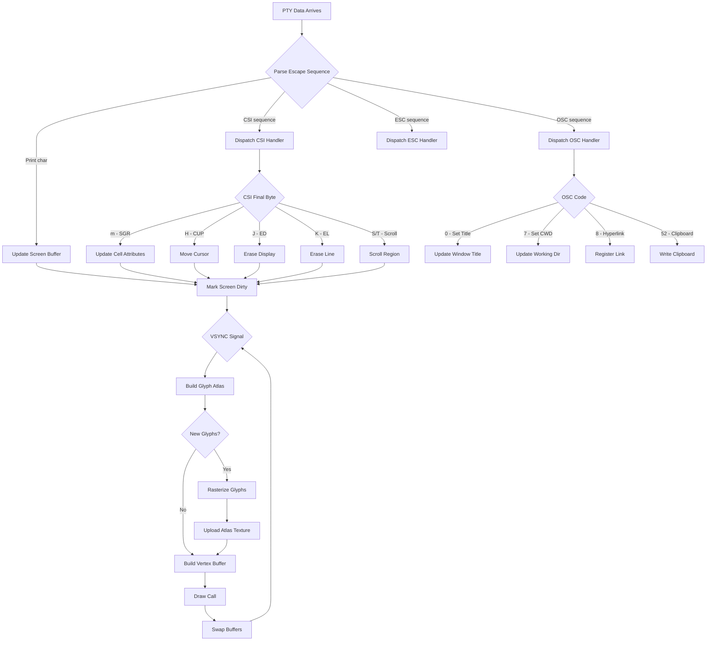

## Sequence Diagram — Plugin Lifecycle

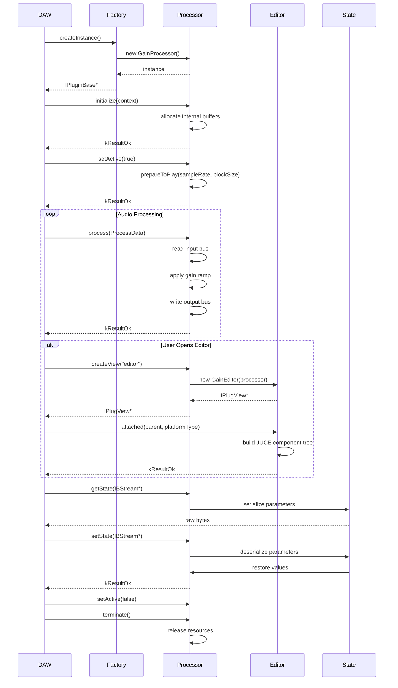

## Class Diagram — Renderer Hierarchy

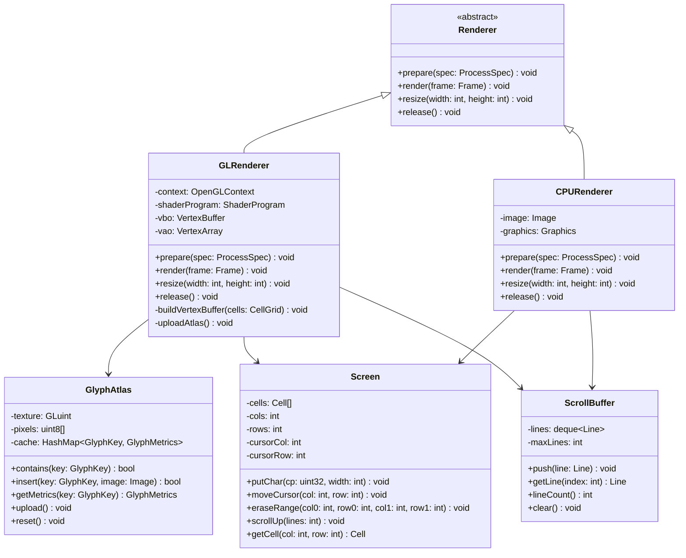

## State Diagram — Parser State Machine

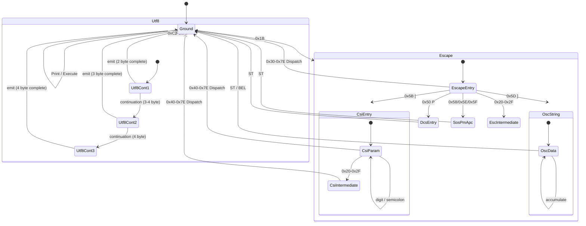

## ER Diagram — Session Storage

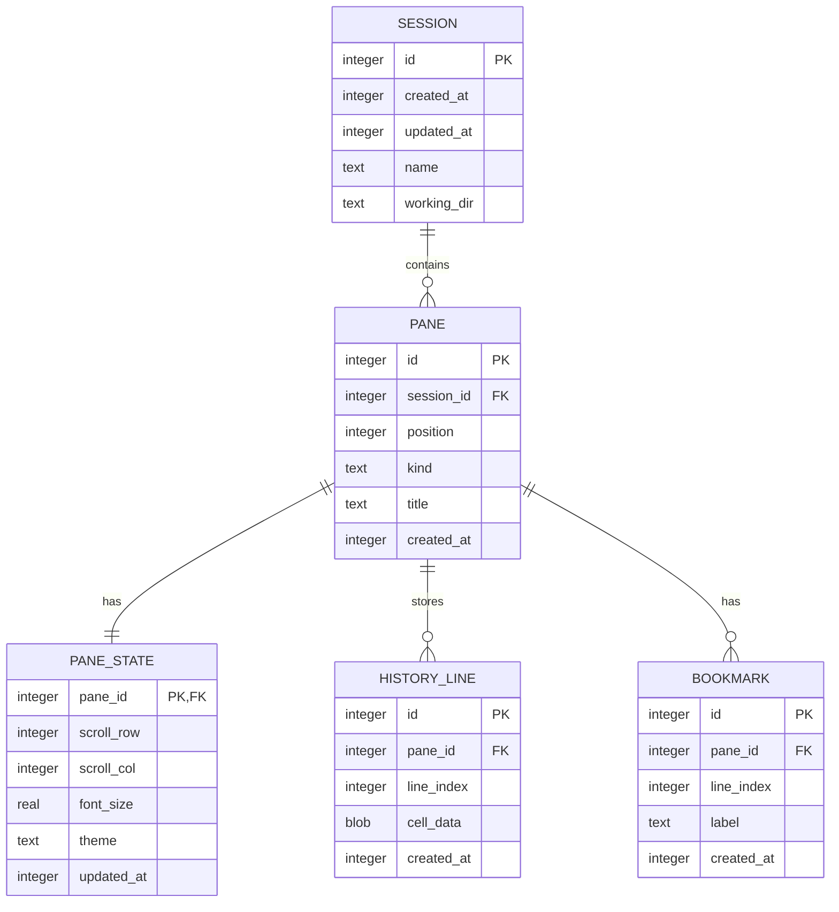

## Gantt Chart — Development Roadmap

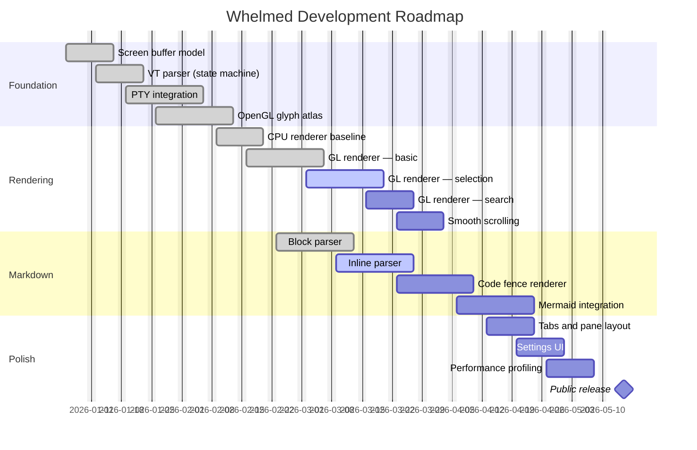

## Pie Chart — Codebase Composition

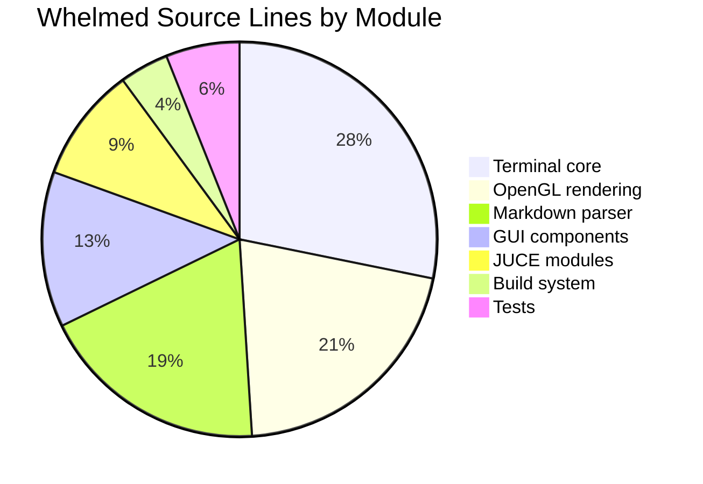

## Git Graph — Branch Strategy

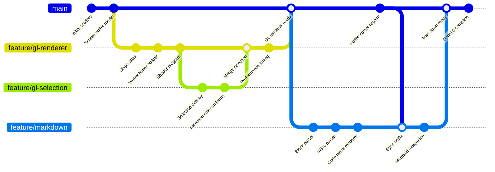

## Mindmap — Architecture Overview

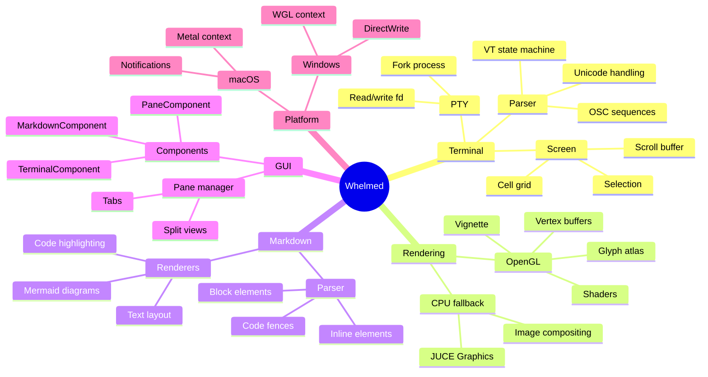

## Timeline — Project History

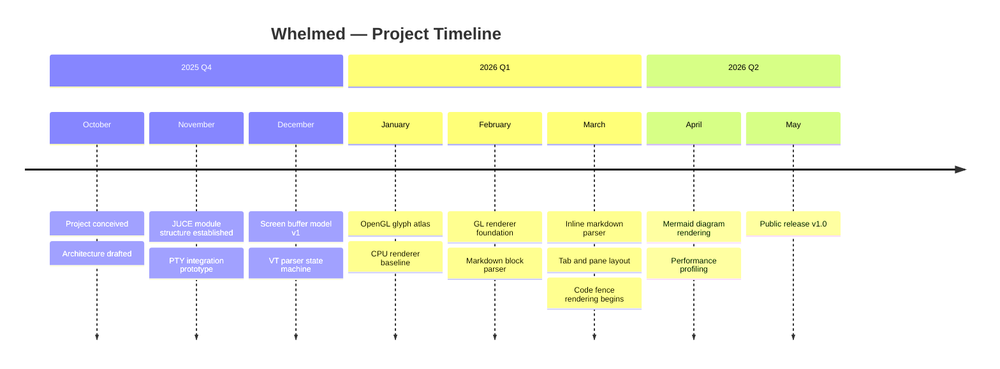

## User Journey — Developer Workflow

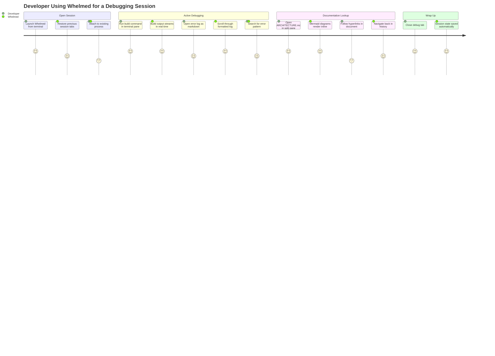

## Quadrant Chart — Feature Priority Matrix

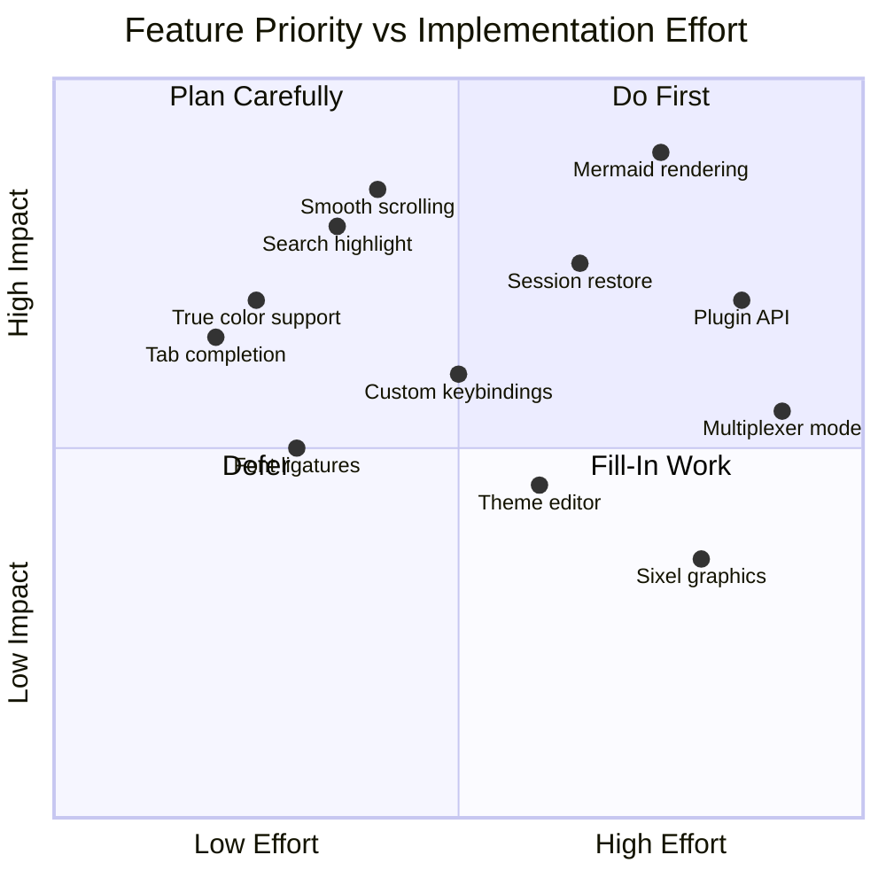

## Sankey Diagram — Data Flow

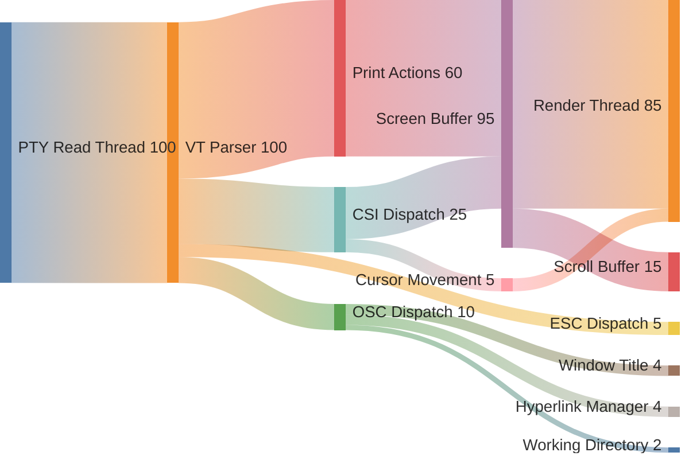

## Block Diagram — System Overview

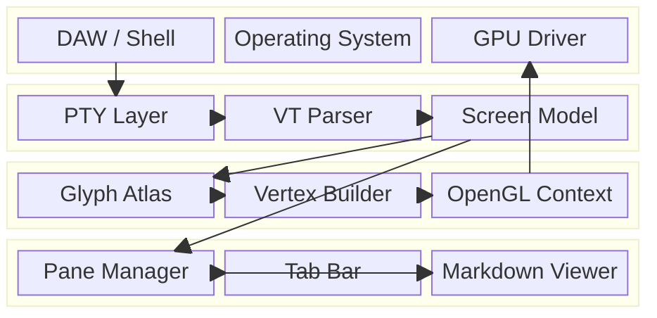

---

# 7. Performance Stress Test

## Large Body Text Block

The OpenGL rendering pipeline for a terminal emulator operates under strict latency constraints that differ fundamentally from those governing game engines or general-purpose graphics applications. A game engine targets thirty or sixty frames per second as a smooth average, tolerating occasional spikes. A terminal emulator must maintain sub-millisecond response to user input even during bursts of high-throughput output, because the user's perception of input lag is not averaged across frames — it is evaluated on every single keystroke.

The glyph atlas is the central data structure around which the entire rendering pipeline is organized. Its purpose is to amortize the cost of CPU-side glyph rasterization by caching the rendered bitmap of each unique glyph on the GPU. Rasterization of a single glyph at a given point size involves font hinting calculations, subpixel antialiasing decisions, and pixel coverage computations that together can require hundreds of microseconds. Without a cache, rendering a screen with four thousand cells would require rasterizing potentially four thousand glyphs per frame, consuming far more time than the sixteen milliseconds available in a sixty-hertz render loop.

The atlas is organized as a two-dimensional bin-packing problem. Glyphs are inserted left to right, top to bottom, with a configurable padding between entries to prevent bilinear sampling artifacts at glyph boundaries. When a row fills, the cursor advances to the next row at an offset equal to the tallest glyph in the completed row. This shelf packing algorithm is not optimal in terms of atlas utilization, but it is simple to implement, fast to execute, and produces good results in practice because most glyphs in a monospace typeface have similar heights.

The vertex buffer is rebuilt on every frame where the screen content has changed. Each glyph cell in the visible area contributes six vertices — two triangles forming a quad — with UV coordinates pointing into the atlas texture and color attributes encoding the cell foreground and background colors in linear floating-point. Modern OpenGL allows all this to be drawn in a single draw call with instancing, but the per-frame vertex buffer approach is simpler to implement and debugs more easily. At typical terminal sizes of eighty by twenty-four to two hundred and twenty by fifty cells, the vertex buffer contains well under one hundred thousand vertices, which fits comfortably within the data throughput of any discrete GPU manufactured in the last decade.

Color handling introduces subtle complexity because the terminal color model and the GPU color model operate in different spaces. The sixteen ANSI palette colors are specified in the sRGB color space as legacy integer triples. True color escape sequences embed sRGB values directly. The GPU, if configured for linear blending, expects values in linear light. The compositing of foreground glyphs over background cells must therefore either convert all colors to linear at the shader stage — adding a gamma decode and encode per fragment — or accept slight inaccuracy by compositing in sRGB. For terminal text where the blending is almost always opaque, the inaccuracy of sRGB blending is imperceptible, and the simpler approach is preferred.

The scroll buffer is a separate allocation from the active screen grid. Lines are evicted from the top of the active grid when the cursor attempts to advance past the bottom of the scroll region, and these evicted lines are moved into the scroll buffer as immutable snapshots. The scroll buffer is sized by the user configuration, typically between one thousand and one hundred thousand lines. Navigation through the scroll buffer does not affect the active screen state, which means the user can scroll back through history while the process continues to write new output, and the new output remains visible when the user scrolls back to the bottom.

The selection model must handle three distinct coordinate spaces simultaneously. The user interacts with screen-space pixel coordinates from mouse events. The renderer works in cell-space integer coordinates when building vertex buffers. The clipboard copy operation works in Unicode string space, reading codepoints from the selected cells and joining them into lines with newlines, respecting wide-character cells which occupy two columns but contribute a single codepoint to the output string. Converting between these spaces requires accurate knowledge of the font metrics, the cell dimensions, the scroll offset, and the device pixel ratio.

Hyperlinks in terminal output are communicated via OSC 8 escape sequences, which bracket the linked text with a start sequence containing the URL and an end sequence that clears the active link. The renderer must track the active link during screen buffer updates and associate a link ID with each cell that was written while a link was active. Hit testing during mouse movement then walks the cell grid to find which link, if any, is under the cursor, and highlights all cells sharing that link ID simultaneously. This requires either a per-cell link ID field adding four bytes per cell to the grid, or a separate sparse structure mapping cell coordinates to link IDs.

Terminal title changes arrive via OSC 0 and OSC 2 sequences. The title is a UTF-8 string of arbitrary length, though practical implementations truncate at two hundred and fifty-six characters. The title must be propagated to the host window system, which on macOS requires a call into the AppKit layer on the main thread, introducing a cross-thread communication requirement into what is otherwise a single-threaded rendering pipeline. JUCE's `MessageManager::callAsync` or a lock-free queue are the standard solutions.

Working directory changes arrive via OSC 7 sequences, which carry a file URI encoding the current directory. These are emitted by well-configured shell prompts after each command completes. The viewer can use this information to provide context-aware actions such as opening files relative to the working directory, displaying the abbreviated path in the tab title, or passing the directory to integrated tools like file pickers and documentation viewers.

## Large C++ Code Block

```cpp
//==============================================================================
// ScreenRenderer.cpp — Full-screen terminal renderer using OpenGL
// This is a stress-test code block exceeding 200 lines.
//==============================================================================

#include "ScreenRenderer.h"
#include "GlyphAtlas.h"
#include "Screen.h"
#include "ScrollBuffer.h"
#include <juce_opengl/juce_opengl.h>
#include <array>
#include <vector>
#include <cstring>

namespace Whelmed {

static constexpr int    kAtlasWidth     = 2048;
static constexpr int    kAtlasHeight    = 2048;
static constexpr int    kMaxVertices    = 1 << 20;
static constexpr float  kGammaEncode   = 2.2f;
static constexpr float  kGammaDecode   = 1.0f / kGammaEncode;

static const char* kVertexShaderSrc = R"glsl(
    #version 330 core
    layout(location = 0) in vec2  a_pos;
    layout(location = 1) in vec2  a_uv;
    layout(location = 2) in vec4  a_fg;
    layout(location = 3) in vec4  a_bg;
    layout(location = 4) in float a_is_glyph;

    out vec2  v_uv;
    out vec4  v_fg;
    out vec4  v_bg;
    out float v_is_glyph;

    uniform mat4 u_projection;
    uniform vec2 u_scroll_offset;

    void main()
    {
        vec2 pos    = a_pos - u_scroll_offset;
        gl_Position = u_projection * vec4(pos, 0.0, 1.0);
        v_uv        = a_uv;
        v_fg        = a_fg;
        v_bg        = a_bg;
        v_is_glyph  = a_is_glyph;
    }
)glsl";

static const char* kFragmentShaderSrc = R"glsl(
    #version 330 core
    in vec2  v_uv;
    in vec4  v_fg;
    in vec4  v_bg;
    in float v_is_glyph;

    out vec4 frag_color;

    uniform sampler2D u_atlas;

    void main()
    {
        if (v_is_glyph > 0.5)
        {
            float alpha = texture(u_atlas, v_uv).r;
            frag_color  = mix(v_bg, v_fg, alpha);
        }
        else
        {
            frag_color = v_bg;
        }
    }
)glsl";

struct Vertex
{
    float x, y;
    float u, v;
    float fg_r, fg_g, fg_b, fg_a;
    float bg_r, bg_g, bg_b, bg_a;
    float is_glyph;
};

static_assert (sizeof (Vertex) == 13 * sizeof (float), "Vertex size mismatch");

//==============================================================================

ScreenRenderer::ScreenRenderer()
    : atlas (std::make_unique<GlyphAtlas<kAtlasWidth, kAtlasHeight>>())
{
}

ScreenRenderer::~ScreenRenderer()
{
    releaseGLResources();
}

void ScreenRenderer::initialise()
{
    jassert (juce::OpenGLHelpers::isContextActive());

    compileShaders();
    createBuffers();
    createAtlasTexture();

    glEnable (GL_BLEND);
    glBlendFunc (GL_SRC_ALPHA, GL_ONE_MINUS_SRC_ALPHA);
    glDisable (GL_DEPTH_TEST);
    glDisable (GL_CULL_FACE);
}

void ScreenRenderer::compileShaders()
{
    const auto vertexId   = glCreateShader (GL_VERTEX_SHADER);
    const auto fragmentId = glCreateShader (GL_FRAGMENT_SHADER);

    const char* vertSrc = kVertexShaderSrc;
    const char* fragSrc = kFragmentShaderSrc;

    glShaderSource  (vertexId,   1, &vertSrc, nullptr);
    glShaderSource  (fragmentId, 1, &fragSrc, nullptr);
    glCompileShader (vertexId);
    glCompileShader (fragmentId);

    shaderProgram = glCreateProgram();
    glAttachShader (shaderProgram, vertexId);
    glAttachShader (shaderProgram, fragmentId);
    glLinkProgram  (shaderProgram);

    glDeleteShader (vertexId);
    glDeleteShader (fragmentId);

    uniformProjection   = glGetUniformLocation (shaderProgram, "u_projection");
    uniformScrollOffset = glGetUniformLocation (shaderProgram, "u_scroll_offset");
    uniformAtlas        = glGetUniformLocation (shaderProgram, "u_atlas");
}

void ScreenRenderer::createBuffers()
{
    glGenVertexArrays (1, &vao);
    glGenBuffers      (1, &vbo);

    glBindVertexArray (vao);
    glBindBuffer      (GL_ARRAY_BUFFER, vbo);
    glBufferData      (GL_ARRAY_BUFFER, kMaxVertices * sizeof (Vertex), nullptr, GL_DYNAMIC_DRAW);

    constexpr GLsizei stride = sizeof (Vertex);
    constexpr auto* base = reinterpret_cast<const char*> (0);

    glEnableVertexAttribArray (0);
    glVertexAttribPointer     (0, 2, GL_FLOAT, GL_FALSE, stride, base + offsetof (Vertex, x));

    glEnableVertexAttribArray (1);
    glVertexAttribPointer     (1, 2, GL_FLOAT, GL_FALSE, stride, base + offsetof (Vertex, u));

    glEnableVertexAttribArray (2);
    glVertexAttribPointer     (2, 4, GL_FLOAT, GL_FALSE, stride, base + offsetof (Vertex, fg_r));

    glEnableVertexAttribArray (3);
    glVertexAttribPointer     (3, 4, GL_FLOAT, GL_FALSE, stride, base + offsetof (Vertex, bg_r));

    glEnableVertexAttribArray (4);
    glVertexAttribPointer     (4, 1, GL_FLOAT, GL_FALSE, stride, base + offsetof (Vertex, is_glyph));

    glBindVertexArray (0);
}

void ScreenRenderer::createAtlasTexture()
{
    glGenTextures   (1, &atlasTexture);
    glBindTexture   (GL_TEXTURE_2D, atlasTexture);
    glTexImage2D    (GL_TEXTURE_2D, 0, GL_R8, kAtlasWidth, kAtlasHeight,
                     0, GL_RED, GL_UNSIGNED_BYTE, nullptr);
    glTexParameteri (GL_TEXTURE_2D, GL_TEXTURE_MIN_FILTER, GL_NEAREST);
    glTexParameteri (GL_TEXTURE_2D, GL_TEXTURE_MAG_FILTER, GL_NEAREST);
    glTexParameteri (GL_TEXTURE_2D, GL_TEXTURE_WRAP_S, GL_CLAMP_TO_EDGE);
    glTexParameteri (GL_TEXTURE_2D, GL_TEXTURE_WRAP_T, GL_CLAMP_TO_EDGE);
}

void ScreenRenderer::render (const Screen& screen,
                              const ScrollBuffer& scrollBuf,
                              float scrollOffsetLines,
                              int viewportWidth,
                              int viewportHeight)
{
    jassert (juce::OpenGLHelpers::isContextActive());

    ensureGlyphs (screen);

    if (atlas->isDirty())
    {
        uploadAtlas();
        atlas->clearDirty();
    }

    vertices.clear();
    buildBackgroundQuads (screen, scrollOffsetLines);
    buildGlyphQuads      (screen, scrollOffsetLines);

    glBindBuffer  (GL_ARRAY_BUFFER, vbo);
    glBufferSubData (GL_ARRAY_BUFFER, 0,
                     static_cast<GLsizeiptr> (vertices.size() * sizeof (Vertex)),
                     vertices.data());

    glViewport (0, 0, viewportWidth, viewportHeight);
    glClearColor (0.0f, 0.0f, 0.0f, 1.0f);
    glClear (GL_COLOR_BUFFER_BIT);

    glUseProgram (shaderProgram);

    const float proj[16] = {
         2.0f / viewportWidth,  0.0f,  0.0f,  0.0f,
         0.0f, -2.0f / viewportHeight,  0.0f,  0.0f,
         0.0f,  0.0f, -1.0f,  0.0f,
        -1.0f,  1.0f,  0.0f,  1.0f
    };

    glUniformMatrix4fv (uniformProjection,   1, GL_FALSE, proj);
    glUniform2f        (uniformScrollOffset, 0.0f, scrollOffsetLines * cellHeight);
    glUniform1i        (uniformAtlas,        0);

    glActiveTexture (GL_TEXTURE0);
    glBindTexture   (GL_TEXTURE_2D, atlasTexture);

    glBindVertexArray (vao);
    glDrawArrays      (GL_TRIANGLES, 0, static_cast<GLsizei> (vertices.size()));
    glBindVertexArray (0);
}

void ScreenRenderer::ensureGlyphs (const Screen& screen)
{
    const int cols = screen.getCols();
    const int rows = screen.getRows();

    for (int row = 0; row < rows; ++row)
    {
        for (int col = 0; col < cols; ++col)
        {
            const Cell& cell = screen.getCell (col, row);

            if (cell.codepoint <= 0x20 || cell.width == 0)
                continue;

            GlyphKey key;
            key.codepoint = cell.codepoint;
            key.fontId    = 0;
            key.pointSize = fontSize;
            key.bold      = (cell.attrs & ATTR_BOLD)   != 0;
            key.italic    = (cell.attrs & ATTR_ITALIC) != 0;

            if (atlas->contains (key))
                continue;

            const auto glyphImage = rasterizeGlyph (key);
            atlas->insert (key, glyphImage);
        }
    }
}

void ScreenRenderer::uploadAtlas()
{
    glBindTexture (GL_TEXTURE_2D, atlasTexture);
    glTexSubImage2D (GL_TEXTURE_2D, 0, 0, 0,
                     kAtlasWidth, kAtlasHeight,
                     GL_RED, GL_UNSIGNED_BYTE,
                     atlas->getPixels().data());
}

void ScreenRenderer::addQuad (float x0, float y0, float x1, float y1,
                               float u0, float v0, float u1, float v1,
                               juce::Colour fg, juce::Colour bg,
                               float isGlyph)
{
    const auto fgR = fg.getFloatRed();
    const auto fgG = fg.getFloatGreen();
    const auto fgB = fg.getFloatBlue();
    const auto fgA = fg.getFloatAlpha();

    const auto bgR = bg.getFloatRed();
    const auto bgG = bg.getFloatGreen();
    const auto bgB = bg.getFloatBlue();
    const auto bgA = bg.getFloatAlpha();

    // Triangle 1
    vertices.push_back ({ x0, y0, u0, v0, fgR, fgG, fgB, fgA, bgR, bgG, bgB, bgA, isGlyph });
    vertices.push_back ({ x1, y0, u1, v0, fgR, fgG, fgB, fgA, bgR, bgG, bgB, bgA, isGlyph });
    vertices.push_back ({ x0, y1, u0, v1, fgR, fgG, fgB, fgA, bgR, bgG, bgB, bgA, isGlyph });

    // Triangle 2
    vertices.push_back ({ x1, y0, u1, v0, fgR, fgG, fgB, fgA, bgR, bgG, bgB, bgA, isGlyph });
    vertices.push_back ({ x1, y1, u1, v1, fgR, fgG, fgB, fgA, bgR, bgG, bgB, bgA, isGlyph });
    vertices.push_back ({ x0, y1, u0, v1, fgR, fgG, fgB, fgA, bgR, bgG, bgB, bgA, isGlyph });
}

void ScreenRenderer::releaseGLResources()
{
    if (shaderProgram) { glDeleteProgram  (shaderProgram); shaderProgram = 0; }
    if (vao)           { glDeleteVertexArrays (1, &vao);   vao = 0; }
    if (vbo)           { glDeleteBuffers  (1, &vbo);       vbo = 0; }
    if (atlasTexture)  { glDeleteTextures (1, &atlasTexture); atlasTexture = 0; }
}

} // namespace Whelmed
```

## Multiple Consecutive Code Blocks

```cpp
// Block 1 — utility function
static juce::Colour colourFromAnsi256 (int index)
{
    jassert (index >= 0 && index < 256);

    if (index < 16)
        return juce::Colour (kAnsiPalette[index]);

    if (index < 232)
    {
        const int i = index - 16;
        const int r = (i / 36) * 51;
        const int g = ((i % 36) / 6) * 51;
        const int b = (i % 6) * 51;
        return juce::Colour (static_cast<juce::uint8> (r),
                             static_cast<juce::uint8> (g),
                             static_cast<juce::uint8> (b));
    }

    const int gray = 8 + (index - 232) * 10;
    return juce::Colour (static_cast<juce::uint8> (gray),
                         static_cast<juce::uint8> (gray),
                         static_cast<juce::uint8> (gray));
}
```

```cpp
// Block 2 — another utility function, directly following block 1
static float linearToSrgb (float linear)
{
    if (linear <= 0.0031308f)
        return linear * 12.92f;

    return 1.055f * std::pow (linear, 1.0f / 2.4f) - 0.055f;
}

static float srgbToLinear (float srgb)
{
    if (srgb <= 0.04045f)
        return srgb / 12.92f;

    return std::pow ((srgb + 0.055f) / 1.055f, 2.4f);
}
```

```c
/* Block 3 — C code immediately after C++ blocks */
static uint32_t pack_color (uint8_t r, uint8_t g, uint8_t b, uint8_t a)
{
    return ((uint32_t)a << 24)
         | ((uint32_t)b << 16)
         | ((uint32_t)g << 8)
         | ((uint32_t)r);
}
```

## Rapid Heading Level Changes

# H1 — Rapid Change Test
Content under H1 heading. This section tests that the renderer correctly transitions between heading levels without accumulated layout errors.

## H2 immediately after H1
Content under H2. The vertical spacing between H1 and H2 should be noticeably smaller than the spacing between a body paragraph and H1.

### H3 immediately after H2
Content under H3. Each heading level introduces progressively less vertical spacing above and below.

#### H4 immediately after H3
Content under H4. At this level, the visual distinction from body text may rely primarily on font weight rather than size.

##### H5 immediately after H4
Content under H5. Rare in practice, must still render correctly.

###### H6 immediately after H5
Content under H6. This is the minimum heading level.

# Back to H1
After visiting all six levels, returning directly to H1 tests that the renderer does not accumulate state from the previous heading chain.

---

# 8. Mixed Content

## Paragraphs Between Code Blocks

The following demonstrates alternating prose and code, which is the most common pattern in technical documentation.

The `GlyphAtlas` class is templated on its dimensions to allow the compiler to generate size-specific code paths and to enable the atlas size to be a compile-time constant rather than a runtime parameter.

```cpp
template<int W, int H>
class GlyphAtlas {
    static constexpr int kWidth  = W;
    static constexpr int kHeight = H;
};
```

The template parameters `W` and `H` must be powers of two for correct OpenGL texture alignment. The static assertions below enforce this at compile time.

```cpp
static_assert ((W & (W - 1)) == 0, "Atlas width must be a power of two");
static_assert ((H & (H - 1)) == 0, "Atlas height must be a power of two");
```

## Headings Between Code Blocks

```cpp
void initPhaseOne() {
    // First initialisation phase
}
```

### Phase Two Initialisation

The second phase runs after the OpenGL context is active and handles GPU resource allocation.

```cpp
void initPhaseTwo() {
    jassert (juce::OpenGLHelpers::isContextActive());
    // GPU resource allocation
}
```

### Phase Three Startup

The third phase connects the renderer to the screen model and begins the render loop.

```cpp
void initPhaseThree (Screen* screen) {
    jassert (screen != nullptr);
    this->screen = screen;
    startRenderLoop();
}
```

## Links and Inline Code Between Code Blocks

The [JUCE OpenGL module](https://juce.com/doc/classjuce_1_1OpenGLContext) provides `juce::OpenGLContext` which manages context creation, activation, and the render callback mechanism. See `juce_opengl.h` for the full API.

```cpp
class MyComponent : public juce::Component,
                    public juce::OpenGLRenderer
{
public:
    void newOpenGLContextCreated()  override { renderer.initialise(); }
    void renderOpenGL()             override { renderer.render(); }
    void openGLContextClosing()     override { renderer.release(); }
private:
    ScreenRenderer renderer;
};
```

The `renderOpenGL` callback is invoked on the OpenGL thread, not the message thread. Any shared data accessed in this callback must be protected by a mutex or atomic, or transferred via a lock-free queue. See the [JUCE threading documentation](https://juce.com/learn/tutorials) for guidance on the `AsyncUpdater` and `MessageManager::Lock` patterns.

## Multiple Styles in a Single Paragraph

This paragraph contains **bold text** followed immediately by *italic text* followed by ***bold italic*** followed by `inline code` followed by a [link to the spec](https://spec.commonmark.org) followed by **bold containing `code` inside it** followed by *italic containing a [link](https://example.com) inside it* and finally returning to normal weight to end the paragraph. All of these transitions must render without gaps, overlaps, or style bleed between adjacent spans.

A technically demanding edge case: **bold text that ends at a sentence boundary**. The space before the next sentence is normal weight. *Italic that starts mid-sentence and runs to the period at the end.* Then a new sentence begins in normal weight.

---

# Appendix — Reference Tables

## ANSI Color Codes

The sixteen named ANSI colors correspond to the following typical sRGB values in the default dark theme:

| Index | Name | Hex | Usage |
|-------|------|-----|-------|
| 0 | Black | `#1a1a1a` | Background, shadows |
| 1 | Red | `#cc4444` | Errors, deletions |
| 2 | Green | `#44aa44` | Success, additions |
| 3 | Yellow | `#aaaa44` | Warnings, modified |
| 4 | Blue | `#4477cc` | Information, links |
| 5 | Magenta | `#aa44aa` | Special, keywords |
| 6 | Cyan | `#44aaaa` | Constants, types |
| 7 | White | `#aaaaaa` | Normal text |
| 8 | Bright Black | `#555555` | Comments, subtle |
| 9 | Bright Red | `#ff6666` | Bright errors |
| 10 | Bright Green | `#66cc66` | Bright success |
| 11 | Bright Yellow | `#cccc66` | Bright warnings |
| 12 | Bright Blue | `#6699ff` | Bright information |
| 13 | Bright Magenta | `#cc66cc` | Bright special |
| 14 | Bright Cyan | `#66cccc` | Bright constants |
| 15 | Bright White | `#ffffff` | Emphasized text |

## CSI Sequence Reference

| Sequence | Name | Description |
|----------|------|-------------|
| `CSI A` | CUU | Cursor Up N lines |
| `CSI B` | CUD | Cursor Down N lines |
| `CSI C` | CUF | Cursor Forward N columns |
| `CSI D` | CUB | Cursor Backward N columns |
| `CSI H` | CUP | Cursor Position (row, col) |
| `CSI J` | ED | Erase Display (0=below, 1=above, 2=all) |
| `CSI K` | EL | Erase Line (0=right, 1=left, 2=all) |
| `CSI L` | IL | Insert Lines |
| `CSI M` | DL | Delete Lines |
| `CSI P` | DCH | Delete Characters |
| `CSI S` | SU | Scroll Up |
| `CSI T` | SD | Scroll Down |
| `CSI m` | SGR | Select Graphic Rendition (colors, attrs) |
| `CSI r` | DECSTBM | Set Scrolling Region |
| `CSI ?h` | DECSET | DEC Private Mode Set |
| `CSI ?l` | DECRST | DEC Private Mode Reset |

---

*End of Whelmed Markdown Viewer — Comprehensive Test Document*
