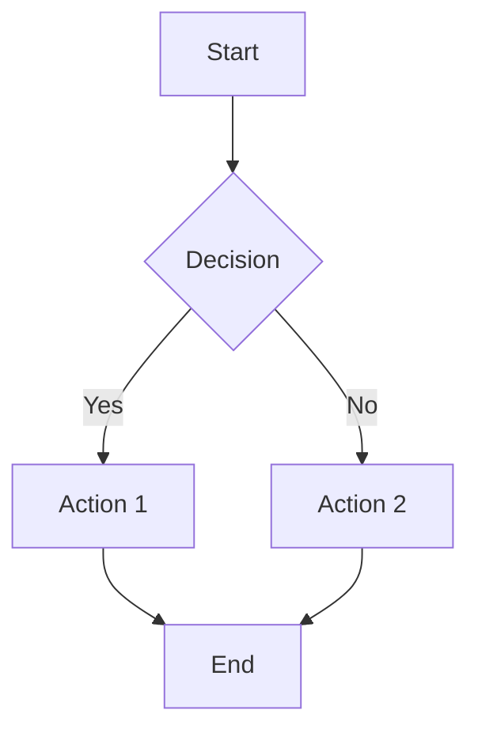
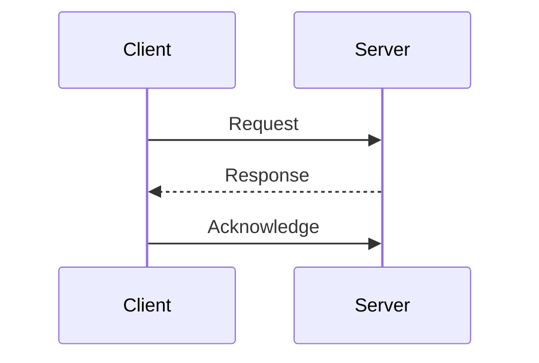
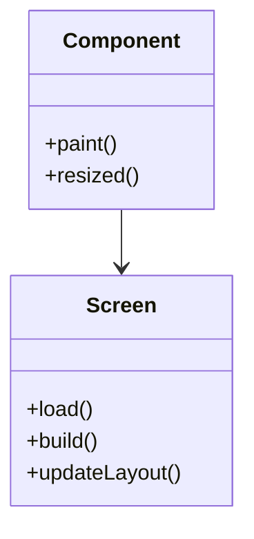
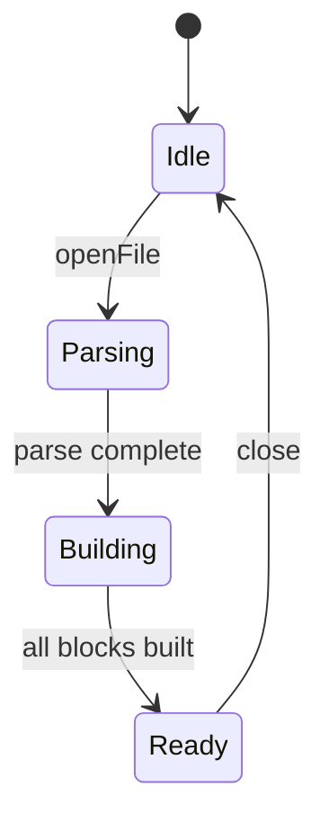
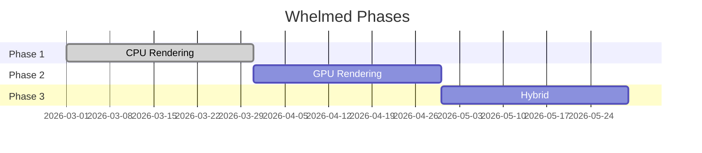
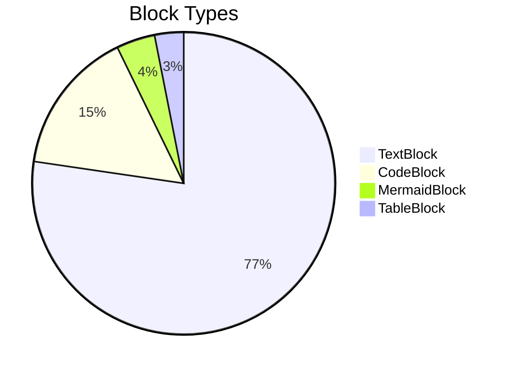
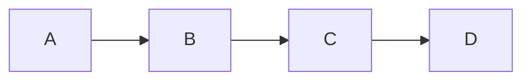

# Mermaid Rendering Test

---

## Flowchart

---

## Sequence Diagram

---

## Class Diagram

---

## State Diagram

---

## Gantt Chart

---

## Pie Chart

---

## Simple Flowchart LR

---

## End
